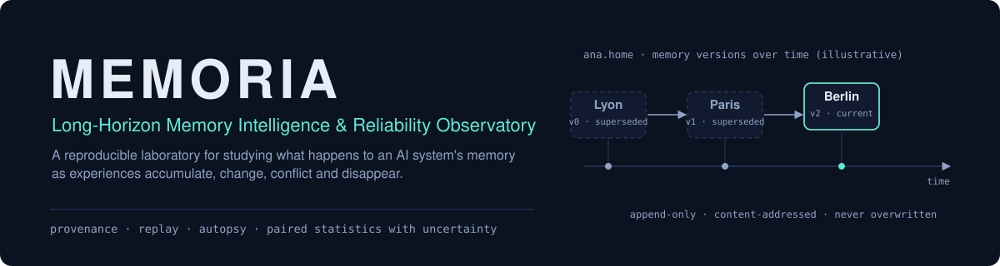
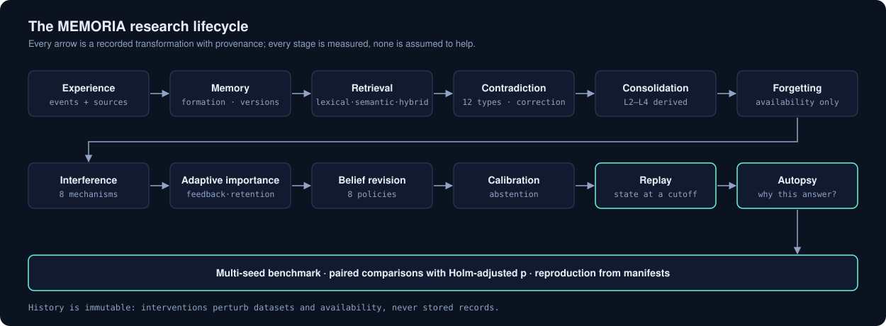
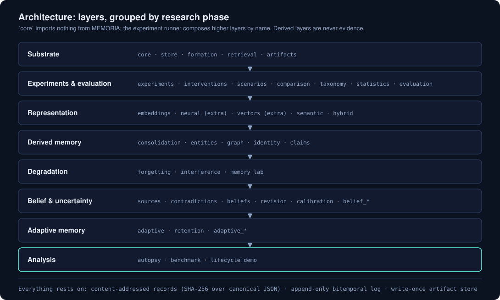
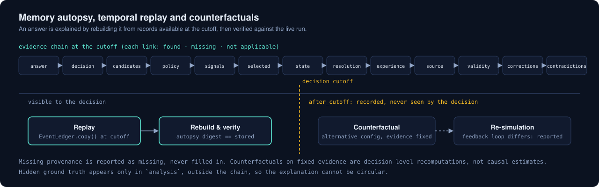

<p align="center">
  
</p>

<p align="center">
  <a href="https://github.com/soyebmohammad03-dev/MEMORIA/actions/workflows/ci.yml"></a>
  
  <a href="LICENSE"></a>
  
</p>

**MEMORIA** is a reproducible laboratory for studying what happens to an AI system's memory
as experiences accumulate, change, conflict and disappear. It treats a memory system as the
*subject* of controlled experiments rather than as a feature: it feeds the subject generated
experience streams, applies interventions, records every transformation with provenance, and
measures the outcome with explicit uncertainty, so that any result can be replayed, audited and
traced back to the experiences that caused it.

> This is a research platform, not a chatbot memory library, and it has no API or UI. Every
> quantitative claim below is a result on **generated worlds** with declared assumptions, not a
> statement about real users or real text. Scope and limitations are listed in
> [Scientific limitations](#scientific-limitations).

## The scientific problem

Long-lived AI systems must decide what to keep, how to represent it, what to retrieve, and what to
believe when new information contradicts old. Most memory work evaluates a finished pipeline on
final answer accuracy. That hides the mechanisms: an answer can be right for the wrong reason,
consolidation can destroy information without changing a single answer, and "newer" is not "truer".
MEMORIA asks the questions accuracy leaves open:

- What becomes durable memory, and what does forming it cost?
- When do similar memories interfere, and how much of a failure is interference rather than
  retrieval?
- How should contradictions revise belief, without equating recency with truth?
- What does forgetting buy (staleness) and what does it cost (missing answers)?
- Can a system say when it does not know, and is its confidence calibrated?
- Why did the system produce this answer, and would replaying its records reproduce it?

The full list (RQ1–RQ15), definitions and invariants are in
[docs/ARCHITECTURE.md](docs/ARCHITECTURE.md).

## What makes it different

| Property | What it means here |
|---|---|
| **Immutable, content-addressed history** | Memory is an append-only, bitemporal log (what was true vs. what was known when). Every record is identified by the SHA-256 of its canonical JSON; nothing is edited in place. |
| **Derived layers are never evidence** | Consolidations, graphs, beliefs and importance are rebuilt from the log and never replace it. Forgetting changes *availability*, never the stored record. |
| **Interventions perturb data, not history** | Attacks and noise are applied to datasets and availability; stored records stay untouched. |
| **Provenance to the experience** | An answer links back through decision, candidates, signals, claims and sources to the original experience, or says a link is missing. |
| **Replay and autopsy** | The state at any cutoff is rebuilt from stored records and compared with the live run; counterfactuals hold evidence fixed and are labelled as not causal. |
| **Statistics with uncertainty** | Wilson intervals, paired Newcombe/McNemar tests, Holm adjustment, replicate-level inference, with underpowered comparisons flagged. |
| **No hidden dependencies on truth** | Ground truth is used only in analysis, outside the evidence chain, so explanations cannot be circular. |

## Research lifecycle

<p align="center"></p>

Each stage is implemented, tested and measured in a study under [docs/experiments](docs/experiments).

## Capabilities

- **History and formation** (`core`, `store`, `formation`): bitemporal, append-only memory log on
  SQLite; create / update / correct / forget; recorded formation decisions, including no-change
  outcomes.
- **Retrieval** (`retrieval`, `embeddings`, `neural`, `vectors`, `semantic`, `hybrid`): lexical,
  recency, semantic (deterministic reference embedder; optional pinned local MiniLM on ONNX
  Runtime; optional FAISS HNSW) and hybrid retrieval whose traces re-derive every score.
- **Experiments and evaluation** (`experiments`, `interventions`, `scenarios`, `comparison`,
  `taxonomy`, `statistics`, `evaluation`): hashed run manifests, a write-once artifact store,
  a `reproduce` check, a provenance-based failure taxonomy, paired statistics.
- **Consolidation and graph** (`consolidation`, `entities`, `graph`, `identity`, `claims`): derived,
  hierarchical memory (L2–L4) with lineage and loss reports; a semantic memory graph in which every
  edge cites its rule and evidence; conservative, recorded entity resolution and free-text claim
  extraction.
- **Forgetting and interference** (`forgetting`, `interference`, `memory_lab`): ten forgetting
  rules as availability interventions with collateral-forgetting measurement; eight controlled
  interference mechanisms measured against a load-0 baseline.
- **Beliefs and calibration** (`sources`, `contradictions`, `beliefs`, `revision`, `calibration`):
  a twelve-type contradiction taxonomy, eight revision policies, independence-aware corroboration,
  calibrated confidence, uncertainty decomposition and selective prediction.
- **Adaptive memory** (`adaptive`, `retention`): a leakage-safe access/feedback ledger, an
  auditable and ablatable importance model, retention schedules.
- **Replay, autopsy and benchmark** (`autopsy`, `benchmark`): evidence-linked autopsy of answers and
  beliefs, temporal replay at a cutoff, fixed-evidence counterfactuals, and a multi-seed benchmark
  over five environments with reproduction from its manifest.

## Architecture

<p align="center"></p>

`core` imports nothing from MEMORIA; only `neural` and `vectors` need optional runtimes (both
checked by tests). Details, module boundaries, storage and the decision log are in
[docs/ARCHITECTURE.md](docs/ARCHITECTURE.md).

### Autopsy, replay and counterfactuals

<p align="center"></p>

## Experimental methodology

- **Generated worlds with hidden truth.** Streams, probes and expectations are generated from
  seeded rules; probe expectations are *epistemic* (what an ideal system could believe given what
  was recorded), independent of any policy. Choices use SHA-256 `unit_interval`, not `random`, so
  results do not depend on the Python version.
- **Manifests and digests.** A run is a pure function of its manifest; `reproduce` re-executes it
  into an independent store and compares digests.
- **Controlled comparisons.** Every study fixes hypotheses first, varies one component at a time,
  and reports paired differences against a named baseline.
- **Inference.** The unit is the replicate (independent seed) or, in the single-seed labs, the
  probe; Holm adjustment within families; underpowered comparisons are flagged rather than hidden.
  Negative and null results are reported.

## Measured findings

Selected results, each with its scope. Numbers are means with 95% intervals over independent
generated replicates unless stated; full tables, definitions and caveats are in the linked report.

| Finding | Scope and evidence | Report |
|---|---|---|
| Topical similarity is not truth: MiniLM rates numeric changes (0.761) and contradictions (0.715) as similar to a query as true paraphrases (0.739). | Diagnostic of 14 queries over 51 memories; a probe, not a benchmark. | [Phase 5](docs/experiments/phase5-semantic.md) |
| Retrieval relevance is not truth: a superseded claim outranked the current one under every policy that surfaces rather than penalises conflict. A temporal filter raised the temporal validity of selected results from 0.831 to 1.000. | 13 author-designed queries; most single-signal changes are within noise. | [Phase 6](docs/experiments/phase6-hybrid.md) |
| Consolidation regime mattered more than depth: occurrence-ordered temporal consolidation raised correct answers in 5 of 8 worlds; unguarded semantic merging destroyed merge precision while leaving answers almost unchanged. | Eight generated worlds, one seed, 36 probes each; most comparisons underpowered. | [Phase 7](docs/experiments/phase7-consolidation.md) |
| Forgetting improved current answers by destroying historical ones; importance-based forgetting harmed accuracy; the graph did not improve retrieval on its own. | World matrix; probe-level intervals treat probes as independent. | [Phases 8–10](docs/experiments/phase8-10-graph-forgetting-interference.md) |
| Recency-aware revision is worst (0.57 correct vs 0.72 for evidence count); source-weighted is best (0.75); conservative policies reach 0.95 selective accuracy at 0.45 coverage. Recalibration cuts expected calibration error from 0.11–0.28 to 0.007–0.031, but does not transfer across worlds. | Ten generated worlds, 1,504 probes pooled; trusted-but-wrong sources defeat every policy. | [Phases 11–12](docs/experiments/phase11-12-beliefs-calibration.md) |
| Importance ranks future *use* (passive AUROC 0.82–0.96) better than *truth* (0.67–0.78); it is a ranking score, not a probability (raw ECE 0.28–0.48). The passive figure is quoted because an active feedback loop inflates predictability. | Five generated worlds, one seed family. | [Super-Phase 5](docs/experiments/superphase5-adaptive-memory.md) |
| On fresh seeds, adaptive ranking raised correctness by **+0.092** [+0.078, +0.105] over static latest-wins (pooled), age-window forgetting lowered it by **−0.260** [−0.305, −0.216], and stale-answer rate moved only under forgetting. Source-weighted belief revision: **+0.059** [+0.044, +0.073]; recency-aware: **−0.140**. | 30 memory and 10 belief replicates × 5 environments, Holm-adjusted; pooled figures average heterogeneous environments; per-environment rows are primary. | [Super-Phase 6](docs/experiments/superphase6-autopsy-replay-benchmark.md) |
| Provenance and replay are consistent: 7,200/7,200 sampled autopsies complete and verified by rebuilding, 181,184/181,184 replayed decisions exact, 170/170 re-executed runs digest-identical. | Holds by construction on generated worlds with complete evidence; it shows internal consistency, not robustness on incomplete real data. | [Super-Phase 6](docs/experiments/superphase6-autopsy-replay-benchmark.md) |

## Installation

Requires Python ≥ 3.12 and [uv](https://docs.astral.sh/uv/). CI runs Python 3.12, 3.13 and 3.14; the
suite passes on all three.

```bash
git clone https://github.com/soyebmohammad03-dev/MEMORIA.git
cd MEMORIA
uv sync                                  # core: pydantic only, no neural dependencies
uv sync --extra neural --extra ann       # optional: ONNX Runtime, tokenizers, FAISS
```

The package is not published to PyPI; install from a checkout.

## Quick start

The end-to-end lifecycle demonstration (about a minute; deterministic) writes an inspectable
artifact store and a report, then rebuilds everything in an independent store to confirm identical
digests:

```bash
uv run python -m memoria.lifecycle_demo var/lifecycle
```

A committed example of its output is in [docs/examples/lifecycle-demo.md](docs/examples/lifecycle-demo.md).
It is a demonstration of one world, **not** a benchmark result.

Each study is one command (there is no other CLI):

| Study | Command |
|---|---|
| Phase 5 semantic representation | `uv run python -m memoria.semantic_eval var/artifacts` |
| Phase 6 hybrid retrieval | `uv run python -m memoria.hybrid_eval var/artifacts hashed` (or `minilm`, needs the neural extra and model) |
| Phase 7 consolidation | `uv run python -m memoria.consolidation_eval var/artifacts` |
| Phases 8–10 graph, forgetting, interference | `uv run python -m memoria.memory_lab var/artifacts` |
| Phases 11–12 beliefs and calibration | `uv run python -m memoria.belief_run var/phase11` (`--quick` for three worlds) |
| Super-Phase 5 adaptive memory | `uv run python -m memoria.adaptive_run var/superphase5` |
| Super-Phase 6 multi-seed benchmark | `uv run python -m memoria.benchmark_run var/bench` (`--quick` for a small run; the full run takes about 25 minutes) |

The neural representation needs the pinned model, which is never downloaded implicitly:

```python
from memoria.neural import MINILM, default_model_dir, fetch_model

fetch_model(MINILM, default_model_dir())  # pinned revision, verified by size and SHA-256
```

Library use, from formation to a retrieval trace:

```python
from memoria.formation import EpisodicPolicy, form
from memoria.scenarios import semantic_diagnostic
from memoria.store import MemoryLog

dataset, _ = semantic_diagnostic()
with MemoryLog(":memory:") as log:
    for step in dataset.steps:
        form(log, step.experience, EpisodicPolicy(), recorded_at=step.recorded_at)
    end = dataset.steps[-1].recorded_at
    state = log.state_as_of(valid_at=end, known_at=end)  # what was true, as known then
```

## Reproducibility

- **Determinism.** Run digests are pure functions of manifests. The lifecycle demonstration
  produces identical artifact digests under different `PYTHONHASHSEED` values.
- **Verification.** `ArtifactStore.verify()` re-hashes every object; each study's `reproduce`
  re-executes runs from the manifest alone into an independent store and compares digests.
- **Environment.** Locked dependencies (`uv.lock`); the environment is recorded separately from
  the manifest, so it cannot change a result's identity. Timing figures are environment-bound and
  say so.
- **Tolerances.** Floating-point behaviour across platforms is bounded and stated
  ([ARCHITECTURE §4.8](docs/ARCHITECTURE.md)); neural embeddings are pinned by revision and hash.

## Project structure

```
src/memoria/            the package (one module per concept; see docs/ARCHITECTURE.md §5)
tests/                  unit, property, adversarial and reproducibility tests
docs/ARCHITECTURE.md    constitution: research questions, invariants, semantics, decision log
docs/ROADMAP.md         phase-by-phase scope and honest status
docs/experiments/       one report per study, with definitions, results, negative findings
docs/examples/          a committed output of the lifecycle demonstration
docs/assets/            diagrams used in this README
.github/                CI, issue and pull-request templates
```

Generated output (`var/`) is git-ignored.

## Scientific limitations

- **Generated worlds only.** Text is templated or drawn from a declared grammar; sources have
  declared priors. Nothing here says how real users, real text or real models behave.
- **Learned parameters do not transfer.** Calibration maps and importance weights are fitted on
  generated replicates.
- **Small designed benchmarks.** Several Phase 5–7 studies use tens of probes and one seed and
  are labelled as probes, not benchmarks; many comparisons are underpowered.
- **Consistency is not robustness.** 100% autopsy completeness and replay exactness holds because
  generated evidence is complete; incomplete provenance is exercised only by designed tests.
- **Counterfactuals are decision-level.** With evidence held fixed they are recomputations, not
  causal estimates of what an alternative system would have done.
- **Heuristics are heuristics.** Guards, entity resolution, claim extraction, contested-answer
  detection and importance features are surface rules with recorded outcomes.
- **Pooled numbers average heterogeneous environments.** Per-environment rows are primary.
- **Not built.** Adaptive retrieval policies inside the hybrid pipeline, a contamination and
  adversarial-source laboratory, a parameterised benchmark generator, sweeps, a research API or
  UI, and portable research bundles (see the roadmap). `neural`/`vectors` need the optional extras.

## Roadmap status

Phases 1–12 are complete. Phases 13 (adaptive retrieval), 16 (longitudinal evaluation) and
17 (autopsy) are partly delivered; Phases 14, 15 and 18–22 are not started. Detail and exit
criteria: [docs/ROADMAP.md](docs/ROADMAP.md).

## Citation

If you use MEMORIA, please cite it using [CITATION.cff](CITATION.cff) (GitHub's
"Cite this repository" button reads it).

## Contributing and development

See [CONTRIBUTING.md](CONTRIBUTING.md). The full quality gate is:

```bash
uv sync --all-extras
uv run ruff check . && uv run ruff format --check .
uv run mypy
uv run pytest
```

Security reports: [SECURITY.md](SECURITY.md). Conduct: [CODE_OF_CONDUCT.md](CODE_OF_CONDUCT.md).
Documentation index: [docs/README.md](docs/README.md).

## License

[MIT](LICENSE) © 2026 Soyeb Mohammad
