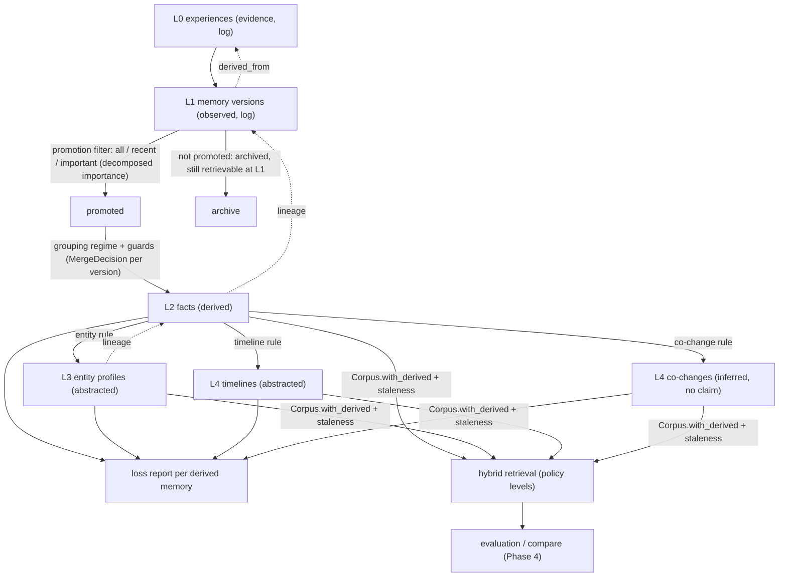
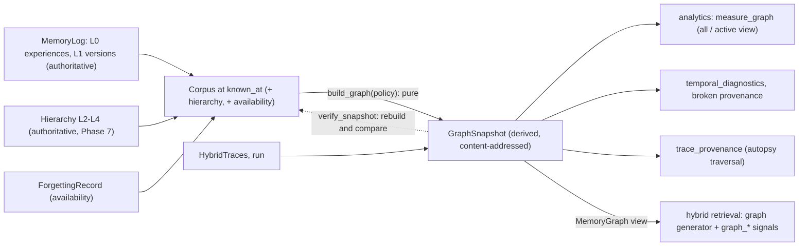
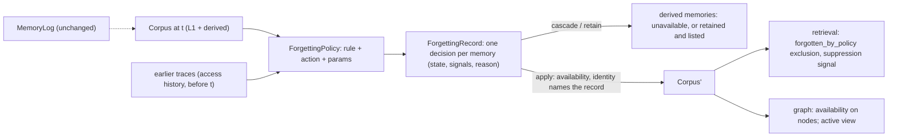

# MEMORIA Constitution & Architecture

Status: **authoritative**. Changes to this document are deliberate, reviewed, and recorded
in the Decision Log (§9). Code that contradicts it is a bug in one of the two.

## 1. Purpose

MEMORIA is an experimental laboratory and observatory for studying the formation,
representation, consolidation, retrieval, revision, forgetting, interference,
contamination, provenance, and reliability of artificial memory over long interaction
horizons. Its founding question remains:

> What actually happens to an AI system's memory as experiences accumulate, change,
> conflict, and disappear over time?

It is an instrument, not a product. Its outputs are **measurements and evidence**, not
chat features. A memory system under study is a *subject*; MEMORIA is the apparatus
that feeds it experiences, intervenes, observes, and records. Different memory
architectures and policies are compared under controlled, reproducible conditions.

### 1.1 The research loop

```
experience → encoding → memory formation → consolidation → memory representation
  → indexing → retrieval → response → evaluation → feedback → belief revision
  → forgetting / interference → longitudinal analysis
```

Every arrow is a recorded, replayable transformation with provenance. Phases 1–4
implement experience → formation → representation (bitemporal versions) → retrieval →
response → evaluation; Phase 5 adds vector representations and indexing, Phase 6
decomposes retrieval into recorded stages (§4.10), and Phase 7 adds consolidation and
abstraction as derived, hierarchical memory over immutable history (§4.12). Phases 8–10
(one combined super-phase) add the semantic memory graph (§4.13), forgetting as a recorded
intervention on availability (§4.14) and controlled interference (§4.15). The remaining
arrows are the roadmap (§8).

### 1.2 Research questions

Each phase names the questions it serves (see [ROADMAP.md](ROADMAP.md)). Answers are
claims only when backed by stored runs and statistics (Principles 1, 3, 4).

| # | Question |
|---|---|
| RQ1 | What information becomes durable memory? |
| RQ2 | What causes memories to be forgotten? |
| RQ3 | When do semantically similar memories interfere? |
| RQ4 | How do contradictory experiences change stored beliefs? |
| RQ5 | How does source reliability affect memory? |
| RQ6 | Does repeated exposure strengthen false information? |
| RQ7 | How does temporal distance affect retrieval? |
| RQ8 | Does semantic abstraction improve or damage factual fidelity? |
| RQ9 | How does consolidation trade specificity for generalisation? |
| RQ10 | How resilient is a memory system to contamination? |
| RQ11 | Can an incorrect memory be corrected without damaging unrelated memories? |
| RQ12 | How does retrieval policy change long-horizon reliability? |
| RQ13 | How does memory capacity affect forgetting and interference? |
| RQ14 | How does retrieval frequency change future recall? |
| RQ15 | Can the system explain exactly why a particular memory influenced a response? |

Phase 6 asks an operational question serving RQ7, RQ12 and RQ15: *when multiple memory
signals disagree, which memories are retrieved, why are they ranked that way, and how
sensitive is the ranking to each signal?* (§4.10, docs/experiments/phase6-hybrid.md).
Phase 7 asks, serving RQ1, RQ8, RQ9 and RQ12: *how does memory consolidation strategy
affect long-horizon retrieval quality, provenance fidelity, information loss,
contradiction handling, computational cost and downstream memory reliability?* (§4.12,
docs/experiments/phase7-consolidation.md).

Phases 8–10 ask, serving RQ2, RQ3, RQ13 and RQ15 (§4.13–4.16,
docs/experiments/phase8-10-graph-forgetting-interference.md):

| # | Question |
|---|---|
| RQ-G1 | Can a provenance-preserving semantic memory graph represent entities, claims, events, temporal relations, contradictions and derived memories without collapsing evidence and inference? |
| RQ-G2 | How does graph structure affect retrieval, contradiction discovery, provenance traversal and long-horizon reasoning? |
| RQ-F1 | What happens to retrieval quality, provenance completeness, contradiction visibility and memory integrity under different forgetting policies? |
| RQ-F2 | Can a system forget operationally while retaining auditable historical evidence? |
| RQ-I1 | How do memories interfere with one another as the memory population grows? |
| RQ-I2 | Which interference mechanisms are most damaging (semantic, entity, temporal overlap, contradictory values, retrieval competition, consolidation, recency, frequency)? |
| RQ-I3 | Can interference be measured separately from retrieval failure? |

## 2. Research Principles

1. **Evidence or silence.** No claim, metric, or chart without the run that produced it.
   Missing evidence is reported as missing, never filled in.
2. **Reproducibility is a requirement.** Every run is determined by a manifest: code
   version, config hash, dataset hash, seeds, model identifiers. Same manifest → same
   result, or the nondeterminism is identified and recorded.
3. **Uncertainty is explicit.** Metrics carry sample size and an interval estimate.
   Point estimates alone are not results.
4. **Controlled comparison.** Effects are claimed only against a baseline under the same
   manifest with one variable changed.
5. **Failures are data.** Failed runs, negative results, and anomalies are retained and
   reportable, not discarded.
6. **Separate observation from interpretation.** Raw records are stored apart from the
   derived analyses that interpret them.
7. **Models are experimental artifacts.** Every model (embedder, reranker, language
   model) is identified by name, version, configuration and pinned weights, and its
   outputs are stored and verifiable like any other artifact.
8. **Honest labels.** Nothing is called semantic, neural, learned or "AI" unless it is.
   Deterministic heuristics are named as what they are.
9. **Laptop-feasible and local-first.** The deterministic core runs without a GPU,
   network access or heavy dependencies. Neural components are optional, local, small,
   and pluggable; no provider is hard-coded.

## 3. Engineering Invariants

These are enforced in code and tests, not by convention.

| # | Invariant |
|---|-----------|
| I1 | Records are immutable once committed. Change = new version, never mutation. |
| I2 | Every record is content-addressed (`sha256:` over canonical JSON). |
| I3 | Memory version history is an append-only, hash-linked chain (`supersedes`). |
| I4 | Every created memory cites ≥1 source `Experience` (no provenance-free memory). |
| I5 | All timestamps are timezone-aware and normalised to UTC. |
| I6 | Time is bitemporal: *valid time* (true in the world) ≠ *record time* (known to system). |
| I7 | Forgetting is a tombstone operation; history is never deleted by the system. A tombstone ends its chain. |
| I8 | Schemas are closed (`extra="forbid"`): unknown fields are errors, not silently kept. |
| I9 | Stochastic components receive an explicit seed; no hidden global RNG state. |
| I10 | Artifacts are written once, addressed by hash, and referenced from a manifest. |
| I11 | Record time never goes backwards, within a chain or across the log. |
| I12 | A version may only cite experiences already in the log that occurred at or before its `recorded_at`. |
| I13 | Stored records are re-verified against their digest on every read; mismatch is an error, never repaired silently. |
| I14 | A stored retrieval freezes the past: later versions and decisions must be recorded strictly after its `known_at`, so the state it observed can always be recomputed. |
| I15 | Every formation outcome is recorded, including decisions to change nothing, with the policy, a reason from a closed vocabulary, and the version it was judged against. |
| I16 | A retrieval trace lists every memory of the queried state and re-derives its own eligibility, totals, ranking and selection; the state it names must be the log's state at its coordinates. |
| I17 | A response cites only versions its trace selected, and cites evidence iff it answers. |
| I18 | Derived scores are quantised (12 decimal places) before recording, so digests do not depend on last-bit floating-point differences between platforms. |
| I19 | Interventions transform datasets (the input stream), never a memory log. Stored history is not branched, edited or replayed selectively. |
| I20 | Probes and their expectations are never changed by interventions: the instrument stays fixed while the input is perturbed. |
| I21 | Every seeded choice is `unit_interval(seed, *labels)`: stateless, platform-independent, and a function of content rather than position or call order. |
| I22 | A run's record and every artifact it names are a deterministic function of its manifest and input artifacts. Environment details are recorded separately and never enter those digests. |
| I23 | Manifest names are resolved through a registry and checked by round-trip: a resolved component must describe itself exactly as the manifest does. |
| I24 | Evaluation only reads run artifacts and writes new ones (`Evaluation`, `RunComparison`). Ground truth and run outputs are never altered. |
| I25 | Every measurement lists the probe ids in its numerator and denominator, and its estimate and interval are validated to follow from those counts. |
| I26 | Undefined is not zero: n = 0 gives no estimate and no interval. Unscorable outputs are excluded from accuracy denominators and reported as their own measurement. |
| I27 | Effects are measured only by paired comparison on identical probes of two runs that differ in exactly one manifest variable (Principle 4). |
| I28 | A classification records the rule that fired and the claims it relied on. Answer text decides *whether* an answer matches; provenance decides *why* it failed. |
| I29 | Every paired test reports its counts, a Newcombe interval, an exact p-value, its Holm adjustment within a family, and whether it is underpowered. |
| I30 | An embedder's identity is its `EmbedderSpec` digest (name, version, dimensions, preprocessing, normalisation, parameters). Every vector is validated for count, dimensionality, finiteness and declared normalisation. |
| I31 | Vectors from different embedder specs are never compared: loading, searching or verifying an index with another embedder is refused. |
| I32 | A semantic index binds its embedder spec, source state, entries, preprocessed-text digests and vector artifact by digest; rebuilding from the source state reproduces the vectors (bit-for-bit for deterministic embedders). |
| I33 | Manifest schema evolution never changes the digest of an existing manifest (§4.7). |
| I34 | A spec that names a model pins it completely: provider, immutable revision, the size and SHA-256 of every file its output depends on, pooling, maximum tokens, truncation, runtime, batch size and tolerance. Licence and descriptions are metadata, not identity. |
| I35 | Model files are verified against the spec before any inference; nothing is downloaded implicitly (only the explicit `fetch_model`). |
| I36 | No silent substitution: an unregistered, missing or unverifiable embedder or index backend is an error, never a fallback, and nothing is stored for a run that could not use what its manifest declares. |
| I37 | Reproduction is classified, never assumed: *identical* (bytes), *equivalent* (within the spec's declared tolerance), or *different*. Deterministic embedders declare no tolerance, so only identity passes. |
| I38 | The exact index is the reference. An approximate index only proposes candidates; every reported similarity is the exact cosine, and what the approximation loses is measured. |
| I39 | A comparison accounts for every manifest field: the retriever and its representation form one variable ("retrieval"), and a manifest field no variable covers is an error. |
| I40 | A retrieval policy is a content-addressed record naming everything that changes a ranking: generators and their limits, hard filters, signals with weights, normalisation, parameters and missing-value behaviour, scoring method, exposure mode, diversity and tie-break. Generators and signals are listed in name order; weights are finite, positive and sum to 1. |
| I41 | Hard filters precede scoring. An excluded candidate records its reason from a closed vocabulary and is never scored, normalised against or ranked. Malformed provenance is always excluded (I4). |
| I42 | Missing is not zero: an unavailable signal records why, and the policy declares whether the query fails or the signal is omitted; an omitted contribution is recorded as omitted. Non-finite or out-of-range values are errors. |
| I43 | A hybrid trace re-derives, from recorded raw values alone: every normalised value, contribution, relevance (= sum of contributions), final score (= relevance − redundancy penalty), the stage order, exposure placements, selection and every explanation. Explanations are derived from recorded numbers, never generated. |
| I44 | No retrieval order depends on dictionary, set, library, filesystem or process order: candidates are listed by (memory_id, version, digest) and ranked by (final, relevance, memory_id, version, digest). |
| I45 | Relevance is a retrieval-policy score, not truth, confidence or memory quality. Temporal compatibility, recency, source priors and conflict status are separate recorded signals; contradictions are exposed, never resolved, in retrieval. |
| I46 | Retrieval never falls back silently: a failing generator raises unless the policy declares that failures are recorded; a policy that needs an embedder or index it was not given is refused; approximate candidates are re-scored exactly (I36, I38). |
| I47 | A hybrid experiment's identity is its spec (benchmark, representation, policies, ablation design, cut-offs, confidence, alpha). Traces are stored and re-verifiable; timings and memory are a separate `PerformanceRecord`. |
| I48 | Derived memory is never evidence. A `DerivedMemory` is its own record type, never a `MemoryVersion` or `Experience`, never appended to the log, and never placed in a `MemoryState`; its epistemic status (derived, abstracted, inferred) is fixed by its operation and can never be observed. Only L1 versions are observed. |
| I49 | Every derived memory cites the L1 versions it covers and their source experiences, and its parents; its lineage resolves downward to the log, and a hierarchy is rejected if any parent is not a lower level or is not covered. |
| I50 | Consolidation is a pure function of (history known at the checkpoint, policy, embedder): replaying it reproduces the hierarchy byte for byte, and nothing in the log changes. |
| I51 | A merge requires the grouping regime to match every member (complete linkage) and no enabled guard to object; a guard-blocked merge is recorded with the guard, never silently applied or dropped. Similarity alone never establishes equivalence. |
| I52 | Consolidation preserves temporal structure: periods are ordered by occurrence, a change closes the earlier period without rewriting it, a correction replaces retroactively and is recorded as an exclusion, same-instant values stay separate and contested. |
| I53 | An inferred pattern asserts no fact claim; an abstraction states only values its supporting memories state (checked as unsupported features). |
| I54 | Every derived memory has a loss report: preserved, lost, altered, conflicting and unsupported features, and lineage coverage of experiences and sources. Its `lost` count must equal the report's. |
| I55 | A consolidation or retrieval policy is a content-addressed record; a run manifest references it by digest (schema v3), and every manifest field belongs to exactly one comparison variable (I39 extended with "consolidation"). |
| I56 | A derived memory whose evidence changed after it was built (retracted, or another value recorded inside its interval) is marked stale at query time; policies declare whether stale memories are excluded. |
| I57 | The memory graph is derived, never evidence: a `GraphSnapshot` is a pure function of (corpus, hierarchies, traces, run, `GraphPolicy`); rebuilding reproduces it byte for byte; nothing is written back to the log or a hierarchy. |
| I58 | Every graph edge names the rule that produced it, cites the records that justify it, and carries an epistemic status no stronger than either endpoint. Only edges that copy a fact from a stored record may be *observed*; co-mentions and resolution candidates are *inferred*. |
| I59 | Structured claims exist only where evidence is structured (the statement language, or a derived memory's declared key and value); free text and inferred patterns are listed as claim-unavailable, never parsed into claims. |
| I60 | Entity resolution merges only by rules the policy accepts; name similarity yields a candidate, never identity, unless a policy says so. Each decision records rule, similarity, declared confidence and evidence; rejecting a pair reverses it; two structured identifiers in one entity are reported as a false merge. |
| I61 | Forgetting changes availability, never history. A `ForgettingRecord` decides every memory's state with the signals its rule used; the log, experiences and hierarchies are unchanged, and the corpus identity (hence every trace over it) names the record. |
| I62 | A derived memory whose evidence is unavailable becomes unavailable (`cascade`) unless the policy explicitly retains it (`retain`); retained ones are listed, so forgotten evidence never influences retrieval unrecorded. |
| I63 | An unavailable memory is excluded before scoring with reason `forgotten_by_policy`; a trace that scores one is invalid. Soft suppression is a recorded signal, not a hidden penalty. |
| I64 | Access-based forgetting reads only retrieval traces recorded strictly before the intervention. |
| I65 | Interference is measured against a controlled baseline: the same replicate at load 0. A failure counts as interference only if the target was retrieved at load 0 and a labelled distractor displaced it at load L. |
| I66 | An interference population is a prefix of one deterministic distractor sequence, and every generated experience carries its ground-truth label (role, mechanism, entity, key, value). |
| I67 | A run's graph snapshots are recorded by digest, one per probe (in its trace and the run record), and rebuilt rather than stored; reproduction re-derives them. |
| I68 | Temporally impossible graph configurations are errors, suspicious ones warnings, by-design retroactivity (corrections) info; diagnostics never repair. |
| I69 | Evidence is authoritative and immutable; a belief is a derived record over it. Contradictory evidence is never deleted, and a belief is never overwritten: a revision is an event with a predecessor, the fingerprints before and after, the reason, and the signals that decided it. |
| I70 | The evidence ledger is replayable: `replay` re-derives every belief and every event from the arrival sequence and the policy, and `violations` audits time, future leakage, chains, supersession, epistemic status, confidence rises and the contribution arithmetic. A belief at time *t* uses only evidence recorded at or before *t*. |
| I71 | Recency is not truth and contradiction is not falsity: a later report supersedes only outside the concurrency window, a rejected value is "not adopted", and `false` is never a belief state. Ties are not wins. |
| I72 | Copies are not independent: corroboration counts source roots after declared copy links; the naive and the independent count are both recorded. Source reliability is a declared prior (cold start is uninformative); a learned trust is circular and always labelled so. |
| I73 | Uncertainty components have operational definitions (`UNCERTAINTY_DEFS`); a confidence is a rule-based score in [0, 1] and is called probabilistic only where a calibration on held-out replicates supports it. Ranking scores are never relabelled as probabilities. |
| I74 | Calibration is fitted on calibration replicates (seed family 2) and evaluated on test replicates (seed family 1); hidden truth and hidden source reliability are used only for analysis. Log loss is refused unless the score is declared probabilistic. |
| I75 | Abstention is a recorded decision with its inputs; errors prevented and answers lost are both counted. Risk–coverage curves handle ties in expectation. |
| I76 | A belief trace either reaches the original experience through every link (answer, belief, events, contribution arithmetic, evidence, source, claim, memory versions, consolidation, graph edges) or lists exactly which link is missing. |
| I77 | Importance is descriptive, never evidence: it is a weighted sum of components computed from recorded access and feedback events and declared source priors, and it is never an input to truth, confidence or correctness. Every `ImportanceRecord` lists its components' raw inputs, the ids of the events it used, its spec digest and its cutoff, and `verify_importance` re-derives it. |
| I78 | A decision sees only events recorded strictly before it, and freezes the past: after a decision at time *t* the ledger refuses any event recorded before *t* (`LeakageError`). Feedback carries when it happened and when it was recorded, and late-recorded feedback is invisible until recorded. |
| I79 | Ground-truth evaluation is not feedback: an event with origin `evaluation` is refused (`CircularEvidenceError`). Feedback comes from the environment (a simulated user with declared noise, independent of correctness for relevance confirmations) or from observation (no correction within a window), never from the instrument that scores the answers. |
| I80 | Retention is availability decided at time *t* from history before *t* by a recorded schedule; nothing is deleted. Every item stays in the store and its record; a `RetentionDecision` records the schedule digest, the state, a closed-vocabulary reason, the cutoff, and the importance record or events it used. An archived item may be retrievable again if a later decision says so. |
| I81 | A free-text claim is `extracted` only when exactly one rule matches its sentence, the sentence is not hedged, the subject is a name (not a pronoun) that resolves to exactly one registered entity and the attribute is known; anything else claim-like is an `unresolved` claim with a closed reason. It keeps the original text digest, the experience, the sentence and (extracted) subject and value spans, and exposes no usable entity, attribute or value. Its `confidence` is a declared rule prior (I59, I73). |
| I82 | Identity outcomes are `resolved`, `ambiguous`, `candidates` or `unknown`; only an exact canonical name or a unique alias resolves, and a shared name is ambiguous, never resolved by picking one. Similarity yields candidates unless the measured baseline policy `similarity` is chosen. Identity assertions merge entities only with independent roots and no declared distinction; a false merge is detectable against a truth partition (I60). |
| I83 | The instrument does not change the system: audit probes create no access or feedback events. Longitudinal measures are separate — retrieval retention, evidence retention, stale-answer rate, revision latency and no-answer rate are never combined into one score. |
| I84 | Effects in the adaptive study are inferred over independent replicates by paired differences with a Student-t interval, an exact sign test, Holm within a world x metric family and an underpowered flag; an onset of damage is the earliest checkpoint or dose on the declared grid at which the adjusted test is significant in the harmful direction, and is a property of the tested design. |

Tooling standard: Python ≥3.12, Pydantic v2, `mypy --strict`, Ruff, pytest with warnings
as errors, `uv` with a committed lockfile, CI on every push.

## 4. Core Domain Concepts

| Concept | Meaning | Status |
|---|---|---|
| **Experience** | A raw source interaction exactly as observed. Root of all provenance. | `core.py` |
| **MemoryVersion** | One immutable version of a memory; bitemporal; hash-linked to its predecessor. | `core.py` |
| **Operation** | Why a version exists: `create`, `update` (world changed), `correct` (prior was wrong), `forget` (tombstone). | `core.py` |
| **Belief** | A version plus the validity interval it effectively holds after later operations (§4.1). | `core.py` |
| **Memory state** | The versions believed at record time *k* to hold at valid time *t*. A pure fold over the log, with its own digest. | `core.py`, `store.py` |
| **Formation decision** | The recorded outcome of one experience under one policy: reason, target memory, basis version, appended version (if any). | `core.py` |
| **Query** | Retrieval text pinned to both time axes (`valid_at`, `known_at`) and a result limit. | `core.py` |
| **Retrieval trace** | Query, full retriever spec, state digest, every candidate with per-signal scores and raw inputs, and the selected version digests. | `core.py` |
| **Response** | An answer (or abstention), the responder that produced it, and the exact version digests it cites. A prompt is added when an LLM responder exists. | `core.py` |
| **Step** | An experience plus the record time at which a system under study ingests it. | `core.py` |
| **Probe / Expectation** | A question pinned to (valid, known) time, with epistemic ground truth: `known` (one value), `unknown`, or `contested` (several values, undecided). | `core.py` |
| **Dataset** | A named, versioned, ingestion-ordered stream of steps plus probes. | `core.py`, `scenarios.py` |
| **Intervention** | A controlled, seeded perturbation of a dataset: delete (`drop`), `delay`, `reorder`, `contaminate`, `inject` (e.g. contradictions). Recorded as an `InterventionRecord` (spec, input, output, step diff). | `interventions.py`, `core.py` |
| **Run manifest** | Everything that determines a run (see Principle 2). Its hash is the run ID. | `core.py` |
| **Run record / outcomes** | Digests of every artifact a run produced; per-step decisions or rejections and per-probe answers next to expectations. | `core.py`, `experiments.py` |
| **Execution** | The environment a run was executed in. Evidence about a run, not part of its identity. | `experiments.py` |
| **Reading / Agreement** | What an output asserts (reader, original text, normalised tokens) and whether that agrees with the expectation. | `comparison.py` |
| **Claim / Relation** | A statement experience read as a claim about one key; how two claims relate (independent, same, retraction, contradiction, correction, temporal change). | `taxonomy.py` |
| **Classification** | A probe outcome class, the rule that fired, the failure locus, and the claims used. | `taxonomy.py` |
| **Measurement** | A metric value with n, interval, the probes counted, and (via its `Evaluation`) the run it came from. | `evaluation.py`, `statistics.py` |
| **Evaluation / RunComparison** | All probe judgements and measurements for one run; a paired baseline-vs-treatment comparison of two evaluations. | `evaluation.py` |
| **Embedder / EmbedderSpec** | Text → fixed-dimension vectors under a recorded identity; `HashedNgramEmbedder` is the deterministic lexical-subword reference (not semantic). | `embeddings.py`, `core.py` |
| **ModelIdentity / Tolerance** | Exactly which model bytes produce vectors; when two outputs of one spec count as equivalent. | `core.py` |
| **NeuralSentenceEmbedder** | A local transformer sentence encoder (ONNX Runtime, CPU) behind the embedder contract; the reference model is MiniLM-L6. An experimental representation, not ground truth. | `neural.py` |
| **RepresentationSpec / IndexSpec** | A retrieval representation: embedder plus index (exact, or HNSW via FAISS). Declared in manifest schema v2. | `core.py` |
| **Semantic index** | Embeddings of a memory state as a stored, verifiable artifact; exact search, optional approximate candidate generation. | `semantic.py`, `vectors.py` |
| **Semantic experiment** | A content-addressed comparison of representations on a labelled diagnostic, with timings recorded separately. | `semantic_eval.py` |
| **Corpus** | Every content-bearing memory version known at `known_at`, with its fate in its chain (held, superseded, forgotten), effective interval and structured claim — what hybrid retrieval can consider, including what filters will exclude. | `hybrid.py` |
| **Retrieval policy** | A versioned, content-addressed hybrid retrieval configuration (I40). | `hybrid.py` |
| **Signal** (hybrid) | A named, versioned feature with a declared direction and range; per candidate a raw value or a recorded reason it is missing (I42). | `hybrid.py` |
| **Hybrid trace** | Generator runs, the candidate union with exclusions, every survivor's signals, contributions, penalties and placement, the selection and explanations; self-checking (I43). | `hybrid.py` |
| **Hybrid experiment** | Policies × benchmark queries with metrics, diagnostics, ablations, leave-one-out, counterfactuals, adversarial cases and paired statistics. | `hybrid_eval.py` |
| **Level / epistemic status** | L0 experiences, L1 formed memories, L2 consolidated facts, L3 concepts, L4 patterns; observed, derived, abstracted, inferred. | `core.py` |
| **Derived memory** | A consolidated or abstracted memory with its lineage, interval, conflicts, support and loss count (I48–I49). | `core.py` |
| **Consolidation policy / hierarchy** | What decides grouping, guards, promotion, abstraction and frequency; the content-addressed result of one consolidation, with merge decisions, loss reports and importance records. | `consolidation.py` |
| **Loss report** | Structured feature accounting of a derived memory against its inputs (I54). | `consolidation.py` |
| **Consolidation lab** | Strategy, ablation, stability–plasticity and retrieval-mode families as ordinary runs, evaluated and compared by Phase 4, plus consolidation metrics against ground-truth labels. | `consolidation_eval.py` |
| **Graph snapshot / policy** | The semantic memory graph of one corpus: typed nodes and provenance-aware edges, structured claims, the entity resolution, claim-unavailable memories and broken provenance; its policy (resolution, claim extraction, temporal semantics, inferred links, retrieval view). | `graph.py` |
| **Graph claim** | Subject, predicate, object, qualifier, interval, sources, epistemic status, supporting memories, contradicting claims, support and dispute counts. | `graph.py` |
| **Mention / resolution** | A normalised name evidence uses (structured identifier or surface name); the recorded decisions that group mentions into entities. | `entities.py` |
| **Provenance trace** | A bounded, deterministic walk from a retrieval or memory to experiences, sources, claims, entities, intervals and consolidations, reporting broken chains. The substrate of the Phase 17 autopsy. | `graph.py` |
| **Forgetting policy / record** | A content-addressed rule (age, fifo, recency, importance, access, validity, contradiction, provenance, hybrid, selective) and action (suppress, archive, exclude, forget); the per-memory availability decisions it produced at one time, with diagnostics. | `forgetting.py` |
| **Availability** | active, suppressed (retrievable, penalised), archived, excluded, forgotten (not retrievable). History is unchanged in every state. | `hybrid.py` |
| **Interference scenario** | One target fact, one probe and a labelled, nested sequence of distractors of one mechanism; observations and load curves against its load-0 baseline. | `interference.py` |
| **Memory lab** | The Phase 8–10 world matrix, structure, interference and interaction studies and the demonstration. | `memory_lab.py` |
| **Event / ledger** | An access (`used`) or feedback (`retrieval_success`, `user_confirmed_relevance`, `correction`, `contradiction_discovered`) on one item, with when it happened, when it was recorded, its origin and cause; the append-only, freeze-on-decision store of them. | `adaptive.py` |
| **Importance record** | One item's importance at one time: components with raw inputs and event ids, weights, cutoff. Descriptive, never truth. | `adaptive.py` |
| **Retention schedule / decision** | A recorded availability rule (keep-all, age window, importance gate, stale-aware gate) and one decision with reason, cutoff and basis. | `retention.py` |
| **Claim (free text)** | A claim-like sentence, extracted or unresolved, with text digest, spans and lineage. | `claims.py` |
| **Identity outcome** | resolved, ambiguous, candidates or unknown for a mention against a registry. | `identity.py` |
| **Autopsy** | The provenance DAG from a response back through retrieval → versions → operations → experiences, at a point in both time axes. | Phase 17 (traversal: `graph.trace_provenance`) |

The `update`/`correct` distinction is deliberate: it separates *temporal change* from
*error repair*, which is necessary to study supersession and contradiction.

### 4.1 History semantics

A memory's chain is folded into an ordered, non-overlapping belief timeline
(`core.beliefs`), considering only versions with `recorded_at <= k`:

| Operation | Effect on the timeline | Constraint |
|---|---|---|
| `create` | Starts the timeline with its own interval. | Version 1 only; cites ≥1 experience. |
| `update` | Appends; the previous belief ends where this one begins. | `valid_from` after the previous belief's. |
| `correct` | Retracts the latest belief entirely, then appends (may re-date). | `valid_from` after the belief that remains before it, if any. |
| `forget` | Retracts every belief. The chain is terminal. | Carries no content and no validity interval. |

Each belief's effective end is the earlier of its own `valid_to` and the next belief's
`valid_from`. State at (*t*, *k*) holds, per memory, the one belief (if any) valid at *t*.

Known limits: `correct` targets only the latest belief, and re-learning a forgotten fact
creates a new memory rather than reviving the tombstoned one.

### 4.2 Formation semantics

`formation.form(log, experience, policy, recorded_at=k)` atomically appends the
experience, asks the policy for a decision, appends the resulting version (if any), and
appends the decision. An experience already in the log yields `duplicate_experience`
without consulting the policy. A log is formed by exactly one policy.

Policies are pure functions of (experience, read-only history, `k`). Two baselines exist:

- **`episodic-v1`** stores each experience verbatim as memory `episode:<digest>`, valid
  from when it occurred. Nothing is superseded; contradictions coexist.
- **`statement-v1`** maintains one memory per key from an explicit statement language —
  `set <key> = <value>`, `correct <key> = <value>`, `forget <key>` (lowercase verbs;
  keys `[a-z0-9_.-]+`; one statement per experience). It does not interpret natural
  language. Memory content is `<key> = <value>`. For a statement occurring at *t* against
  the live memory's current belief `head`:

| Condition (checked in order) | Reason | Operation |
|---|---|---|
| not a statement | `unparsed` | — |
| no live memory, `set` | `new_key`, or `relearned` (new memory `key#n`, basis = tombstone) | create, valid from *t* |
| no live memory, `correct`/`forget` | `unknown_key` | — |
| *t* < `head.valid_from` | `stale` | — |
| `forget` | `explicit_forget` | forget |
| same content as `head` | `redundant` | — |
| *t* = `head.valid_from` | `conflicting` (first recorded wins) | — |
| `set` | `value_changed` | update, valid from *t* |
| `correct` | `explicit_correction` | correct, over `head`'s interval |

Known limits: late-arriving older facts are recorded as `stale` rather than inserted into
the past; same-instant conflicts are recorded, not resolved.

### 4.3 Retrieval semantics

A `Retriever` ranks the memories of `state_as_of(query.valid_at, query.known_at)`. Each
**signal** scores every memory and records named raw inputs. A candidate is eligible iff
the **gate** signal scores > 0; its total is Σ weight × score; candidates are ordered by
(eligible first, total descending, `memory_id` ascending) and the first `limit` eligible
are selected. Signals:

- **`bm25`**: Okapi BM25 (k1 = 1.2, b = 0.75 by default) over case-folded Unicode word
  tokens, no stemming or stop words, idf = ln(1 + (N − df + 0.5)/(df + 0.5)) with corpus
  statistics from the queried state; query terms de-duplicated. Inputs: per matched term
  tf, df, idf and contribution; document length, average length, N.
- **`recency`**: 0.5^(age/half-life) in days, on the record axis (age since recorded, as
  of `known_at`) or the valid axis (age since the belief began, as of `valid_at`).

Presets: `lexical()` = `bm25-v1` (BM25 only); `lexical_recency()` = `bm25+recency-v1`
(BM25 gate, recency weight 0.5, half-life 30 days). Weights are recorded in every trace;
they are baselines, not tuned values. The `extractive-top1-v1` responder answers with
the top selected memory's content verbatim and abstains when nothing is selected.

Known limits: tie-breaking by `memory_id` is deterministic but semantically arbitrary
(the episodic baseline demonstrably returns a stale report on a three-way tie). This
single-stage `Retriever` remains the retriever of experiment runs, unchanged; multi-stage
hybrid retrieval (candidate generation, filters, normalisation, fusion, diversity,
exposure) is `memoria.hybrid` (§4.10) and is not yet a run-manifest variable.

### 4.4 Experiment semantics

`experiments.execute(manifest, store)`:

1. Resolves the policy, retriever, responder and interventions the manifest names (I23),
   and loads the dataset by digest, before doing any work. Unresolvable manifests fail
   without writing anything.
2. Applies interventions in order; stores every derived dataset and an
   `InterventionRecord` linking input → output with the exact step diff.
3. Ingests the effective dataset into a fresh log with `formation.form`. A step the log
   refuses is recorded as a rejection (with the reason) and the run continues.
4. Asks every probe with `retrieval.answer`, recording trace and response in the log.
5. Stores the log's canonical export, a `RunOutcomes` table, the manifest, the
   `RunRecord`, and a separate `Execution` record.

`reproduce(run, store)` re-executes the stored manifest and compares every artifact
digest; differing artifacts are kept alongside the originals.

**Interventions** (all parameters, including seeds, are recorded):

| Name | Effect | Never |
|---|---|---|
| `drop(rate, seed)` | removes selected steps | — |
| `delay(rate, seed, days)` | ingests selected steps later; the experience is unchanged | moves ingestion earlier |
| `reorder(seed, window_days)` | jitters ingestion order within a window, then keeps record time monotone | ingests anything earlier than planned |
| `contaminate(rate, seed, delay_days, source)` | adds a false copy (`<value> (contaminated)`) of selected `set`/`correct` statements; source `<source>:<original digest>`. `delay_days = 0` is a same-instant contradiction | touches non-statements |
| `inject(dataset)` | merges another stored dataset's steps (hand-built contradictions or contamination) | — |

**Ground truth** is epistemic and fixed on the authored dataset (I20): what an ideal
system could believe about `valid_at` from experiences recorded by `known_at` — the
latest report *by occurrence* holds; equal-time disagreement is `contested`; honouring
`forget` yields `unknown`. Recency of ingestion never makes a report more true. Under an
intervention the expectation is unchanged, so runs measure degradation against a fixed
reference. `RunOutcomes` records answers next to expectations; **judging them is Phase 4**.

Datasets: `scenarios.relocation_year()` (hand-built, 16 steps, 12 probes covering every
expectation status) and `scenarios.drifting_facts(seed, ...)` (generated, with ground truth
computed from the simulated world, `epistemic_truth`).

Not in Phase 3: contradiction/consistency *classification* (belongs with the Phase 4
failure taxonomy), scoring and statistics, a CLI.

### 4.5 Evaluation semantics

`evaluation.evaluate(run, store, spec)` reads a stored run and writes an `Evaluation`;
`evaluation.compare(baseline, treatment, store)` writes a `RunComparison`. The
`EvaluationSpec` (readers and their order, comparator `tokens-v1`, classifier
`provenance-v1`, confidence, alpha) is part of every result's identity.

Pipeline, per probe: observation (stored outcome, trace, response, log) → **reading**
→ **agreement** → **classification** → measurement → statistics.

**Comparison** (`comparison.py`). Values are equal iff their token sequences are equal
after Unicode NFKC, case folding and word tokenisation — no stemming, synonyms or fuzzy
thresholds. Readers, first applicable wins: `statement` (`set|correct k = v`),
`assignment` (`k = v`, memory content), `mention` (whole-token occurrences of dataset
values in free text; longer matches absorb contained ones; two distinct values =
ambiguous). The original output, reader and tokens are kept.

**Fact model** (`taxonomy.py`). Statement experiences are claims. Two claims on one key
are related by *occurrence* time: same instant and different values = contradiction;
different times = temporal change, or correction when the later one is a `correct`.
Ingestion order never decides. The *observed* claim is found through provenance
(cited version → source experience → claim); the *support* is the latest-occurring
authored claim(s) visible at `known_at` that assert an expected value.

**Outcomes** (one per probe; rules checked in this order, each recorded by id):

| Situation | Outcome | Category |
|---|---|---|
| abstained; expected `unknown` | `correct_abstention` | success |
| abstained; `contested` | `contested_abstained` | neutral |
| abstained; expected memory held / not held | `retrieval_miss` / `missing_memory` | failure |
| matched; `known` / `contested` | `correct` / `contested_answered` | success / neutral |
| several values mentioned | `ambiguous_output` | unscorable |
| unreadable; cites only memories about other subjects | `wrong_memory` | failure |
| unreadable; cites a subject memory asserting no value (`forget`) | treated as a non-answer (the abstention outcomes above) | — |
| unreadable otherwise | `malformed_output` | unscorable |
| mismatch; expectation has no supporting claim | `unclassifiable` | unscorable |
| answer not in the cited evidence / asserted by no visible claim | `unsupported` | failure |
| observed claim is about another key | `wrong_memory` (interference) | failure |
| observed claim was introduced by an intervention | `contaminated` | failure |
| `unknown` expected; claim later forgotten | `forgotten_recalled` | failure |
| claim not yet true at `valid_at` (corrections exempt: retroactive) | `temporal_error` | failure |
| claim is the value a correction replaced | `correction_failure` | failure |
| claim contradicts the support at the same instant | `contradiction` | failure |
| claim is older than the support | `stale` | failure |
| claim is newer than the support | `unsupported` | failure |

**Locus** of a failure: `retrieval` if a memory asserting the expected value was in the
queried state (or the answer came from another subject's memory), else `memory`. For
known-value failures without the expected memory, the **cause** is determined from the
run: `not_ingested` (never in the stream), `not_yet_ingested` (after `known_at`),
`rejected_by_log`, `rejected_by_policy` (with the policy's reason), `superseded`, or
`outside_validity` (believed, but its interval excludes `valid_at`).

**Measurements** (fixed set; each lists its probes): `coverage`, `unscorable` (all
probes); `known.correct`, `known.abstained`, `known.expected_in_state` (scorable
known-value probes); `known.expected_selected_given_in_state`; `unknown.abstained`;
`contested.answered`; `outcome.<class>` for every class (all probes; a partition);
`failure.locus.<locus>` (failures); `failure.cause.<cause>` (known-value failures without
the expected memory — causes may sum to less than the population if undetermined).

**Statistics** (`statistics.py`). Proportions: Wilson score interval. Paired comparison
of an indicator on the same probes: difference treatment − baseline with Newcombe (1998)
method 10 interval (continuity-corrected phi; reproduces the paper's Table III), exact
two-sided McNemar p-value, Holm adjustment within a family (`primary`, `outcome`,
`locus`), and `underpowered` when even the most one-sided split of the discordant pairs
could not reach `alpha` (e.g. ≤ 5 discordant pairs at 0.05). Transitions list which
probes moved between which outcomes.

**Assumptions and limits.** Intervals treat probes as independent; probes about the same
key share memory state, so intervals may be optimistic for clustered probes (cluster-aware
methods are deferred). Multiplicity is adjusted within a comparison, not across
comparisons. The fact model is the statement language: datasets without it are compared
on text, but claim-based classes cannot apply. The mention reader recognises only values
asserted somewhere in the dataset.

### 4.6 Semantic memory semantics (Phase 5)

**Embedders.** `embeddings.embed(embedder, texts)` applies the spec's `Preprocessing`
(NFKC, case folding, whitespace collapse, optional truncation — each recorded), encodes,
and validates count, dimensionality, finiteness and declared normalisation.

- `HashedNgramEmbedder` (`hashed-char-ngrams` v1): signed SHA-256 feature hashing of
  character n-grams, L2-normalised integer counts; empty text is the zero vector. It
  captures spelling, not meaning, and is byte-deterministic everywhere. It is the control
  condition for every semantic experiment.
- `NeuralSentenceEmbedder` (`onnx-sentence` v1): tokenise with the model's own tokenizer,
  truncating right at `max_tokens`; run the encoder on the CPU (ONNX Runtime, one thread,
  sequential, one text per batch so padding never depends on neighbours); mean-pool over
  the attention mask (or take the first token, for `cls`); L2-normalise. The reference
  model is `sentence-transformers/all-MiniLM-L6-v2` pinned by revision and file hashes
  (`neural.MINILM`). Its preprocessing applies NFKC and whitespace collapse but not case
  folding, because the model's tokenizer lowercases. The adapter reproduces the published
  sentence-transformers pipeline to 3.5e-7 per component (docs/experiments/phase5-semantic.md).
  ONNX Runtime's POSIX build contains an HTTP telemetry client (Microsoft 1DS). The adapter
  sets `ORT_DISABLE_TELEMETRY=1` before onnxruntime initialises and also calls
  `disable_telemetry_events()`. If a host application imports onnxruntime before MEMORIA
  without the variable, only the second switch applies; set the variable in the
  environment to be certain.

A neural embedding is an **experimental representation, not ground truth**: it encodes
the model's notion of similarity, which the Phase 5 study shows tracks topic rather than
truth (numeric changes and contradictions score like paraphrases). Similarities are not
understanding.

**Indexes.** `semantic.SemanticIndex.build(state, embedder, store, index)` stores the
`MemoryState`, a little-endian float32 vector blob, any serialised approximate index, and
an `IndexManifest` binding embedder spec, index spec, source state, entries (in state
order — the insertion order), memory ids and preprocessed-text digests. `search` returns
`Neighbor`s carrying rank, exact quantised cosine, version, text digest, source state,
index and embedder digests, and the representation used; ties by `memory_id`, then
digest. `similarities` gives the exact cosine to every entry. `load` and `search` refuse a
different embedder; `require_source` refuses a stale index; `verify` re-embeds the source
state and classifies the vectors under I37.

**Exact versus approximate.** `vectors.HnswIndex` (FAISS `IndexHNSWFlat` over inner
product on normalised vectors; one thread; FAISS's fixed internal seed; FAISS default
parameters M = 16, efConstruction = 40, efSearch = 16) proposes candidates, which are
re-scored exactly (I38). `semantic_eval.compare_indexes` reports recall@k, top-1
agreement, rank displacement and the exact items lost; build time, latency and size are
in performance records.

**In runs.** `retrieval.SemanticSignal` scores every memory of the queried state by exact
cosine under the manifest's embedder (score = max(cosine, 0), raw cosine recorded; as a
gate, eligible iff cosine > 0 — orthogonality, not a tuned threshold). Because a signal
must score every memory, runs use the exact index; approximate candidate generation is
used by the hybrid engine's semantic generator (§4.10).

### 4.7 Experiment degrees of freedom and manifest schema v2

The target experiment model varies, independently and explicitly: memory architecture,
formation policy, consolidation policy, retrieval policy, forgetting policy, source
model, embedding model, reranker, dataset, interventions, and evaluation specification.

`RunManifest` records dataset, interventions, formation policy, retriever, responder and,
since schema v2, `representation` (a `RepresentationSpec`: embedder spec — provider,
model identity and configuration, dimensions — and index spec: kind, backend,
parameters). Evaluation specs are recorded by `Evaluation`.

Schema evolution (I33) uses `core.ExtensibleRecord`: fields listed in `_evolved` are
omitted from every serialisation while at their default, recursively, so a v1 manifest
keeps its digest and run ID (verified against digests computed by the pre-v2 code). The
same mechanism extends `EmbedderSpec` (neural fields) and `IndexManifest` (index kind,
approximate artifact). A new evolved field must default to the prior behaviour.

The runner enforces that a representation is declared iff a retriever signal uses
vectors, that its embedder is registered and rebuilds to the declared spec, and that
runs use the exact index. Comparisons treat retriever and representation as one variable,
"retrieval" (I39). Nothing that changes results may live in global configuration; the
model directory is execution environment (`MEMORIA_MODELS`), verified against the spec.

### 4.8 Reproducibility boundaries and tolerance

| Artifact | Guarantee |
|---|---|
| Records, datasets, logs, traces, evaluations | byte-identical everywhere |
| Reference embeddings and their indexes | byte-identical everywhere (integer counts, one correctly rounded division) |
| Neural embeddings on one machine and runtime | byte-identical run to run (verified) |
| Neural embeddings across runtimes or hardware | equivalent within the declared tolerance |
| HNSW graphs | a deterministic function of vectors, order and parameters; rebuilt byte-identically when vectors are identical |
| Timings, memory, sizes on disk | environment-bound; recorded separately, never in a result's identity |

Tolerance for `onnx-sentence` MiniLM: every component within 1e-4 and cosine ≥ 0.9999
between corresponding vectors. Rationale: float32 inference differs across CPU kernels
and runtime versions in the last bits; measured ONNX Runtime versus PyTorch differences
are ≤ 3.5e-7, so the bound has ~300× margin. For unit vectors it implies similarities move
by at most 2·√d·max_abs ≈ 0.004, below the gaps that separate ranks in the Phase 5 study.
Cross-hardware equivalence has not yet been measured (CI does not download models); it
is a stated hypothesis until it is.

### 4.9 Semantic diagnostic methodology

`scenarios.semantic_diagnostic()` is a controlled probe, not a benchmark: 51 memories
about seven subjects, each with variants labelled by designed relationship (paraphrase,
equivalent wording, other source, temporal variant, contradiction, negation, numeric
change, entity substitution, lexical distractor, shared vocabulary) and two queries per
subject (worded, reworded). Relevance is topical: about the query's subject and
attribute. `semantic_eval.run_semantic_experiment` separates **representation quality**
(similarity profiles per label; separation of meaning-preserving from meaning-changing
variants) from **retrieval quality** (recall and precision at k with Wilson intervals and
the attainable maximum, reciprocal rank, false matches and misses by label, paired
Newcombe/McNemar differences, top-k overlap). Paired items share queries, so intervals
may be optimistic. Results: docs/experiments/phase5-semantic.md.

### 4.10 Hybrid retrieval semantics (Phase 6)

`memoria.hybrid` separates seven concerns. They stay separate in code, records and
experiments:

| Concern | Question it answers | Where |
|---|---|---|
| Representation | How is a memory encoded (tokens, vectors)? | `retrieval.tokenize`, `embeddings`, `semantic` |
| Candidate generation | Which memories are considered at all? | generators in `Engine._generate` |
| Hard filtering | Which considered memories may not be returned, and why? | `Exclusion`, policy `exclude` |
| Feature extraction | What does each signal say about each survivor? | `SIGNALS` registry, `SignalValue` |
| Scoring | How do signals combine into relevance? | normalisation, weighted sum or RRF |
| Reranking | How is the order adjusted beyond relevance? | MMR diversity, contradiction exposure |
| Evaluation | What did the policy retrieve, measured against designed roles? | `hybrid_eval` |

```
MemoryLog ──► Corpus(known_at): every version with fate, effective interval, claim
                 │
   ┌─────────────┼──────────────┐
 lexical      semantic       metadata          candidate generation (each: rank, score,
 BM25 > 0   index top-k      claim key            limit, truncation, status, error)
   └─────────────┼──────────────┘
          candidate union ─────────────────►   merged by version; generator hits kept
                 │
          hard filters ────────────────────►   excluded(reason): future, expired,
                 │                               superseded, forgotten, malformed provenance
          features: SignalValue(raw | missing, inputs)   per policy signal
                 │
          normalisation (bounded | minmax | rank | zscore, over survivors)
                 │
          relevance = Σ contribution           weighted: w·direction·normalised
                 │                              rrf:      w / (k + rank)
          diversity (optional MMR): final = relevance − β·max(0, similarity to earlier)
                 │
          exposure: neutral | penalize (signal) | surface (counter-evidence) | paired
                 │
          ranking, selection, Explanation(reasons, text) ─► HybridTrace (self-checking)
```

**Corpus.** Hybrid retrieval considers every non-tombstone version recorded by `known_at`,
not only the state at (`valid_at`, `known_at`), so temporal and history exclusions are
recorded rather than silent. Each version's *fate* comes from its chain (`core.beliefs`):
held (with its effective interval), superseded (removed by a later CORRECT) or forgotten
(chain ends in FORGET). Its *claim* comes from its cited experiences through the statement
language; a version citing experiences with different claims has none (`ambiguous`), and
free text has none (`unstructured`).

**Temporal status** at `valid_at`: valid (interval contains it), expired (ended at or
before), future (starts after), superseded, forgotten. A memory from before `valid_at` is
not "wrong", and the newest memory is not "right": temporal status is compatibility with
the requested time, not truth. Every version carries `valid_from`, so "temporally
unspecified" cannot arise from current memory types.

**Conflict status** (Phase 4 relations on the claim's key, judged at `valid_at`), in
priority order: forgotten (a later `forget` occurring by `valid_at`), corrected (a later
`correct`; retroactive), contradicted (another value at the same instant), superseded (a
later value occurring by `valid_at`), supported (same value elsewhere), undisputed;
`retraction` for a `forget` claim itself; unavailable without a claim. *Counter-evidence*
for a memory is every version asserting another value for its key (older or newer) or
retracting it.

**Generators.** `lexical`: BM25 over the corpus (statistics from the corpus), proposing
scores > 0. `semantic`: a `SemanticIndex` (exact or HNSW, declared by the policy) over the
state at (`known_at`, `known_at`); a stale or mismatched index is a generator failure.
`metadata`: memories whose claim key equals the query key; *not applicable* without a key.
Each proposes at most its limit, ordered by (score desc, memory_id, version, digest), and
records how many qualifying candidates the limit dropped.

**Signals** (`SIGNALS`; name, version, direction, declared range):

| Signal | Raw value | Missing when |
|---|---|---|
| `lexical` | BM25 score (unbounded) | never (0 is real evidence of no overlap) |
| `semantic` | exact float32 cosine, [−1, 1] | never (an embedder is required) |
| `recency` | 0.5^(age/half-life), family `exponential`, axis `recorded` (age to `known_at`) or `valid` (age to `valid_at`) | valid axis and not yet valid |
| `temporal` | 1 if valid at `valid_at`, else 0 (compatibility) | never |
| `source` | declared prior of the cited sources' class (`<class>:<id>`); several sources: the minimum | unstructured or undeclared source |
| `provenance` | fraction of cited experiences resolved with a structured source id | never |
| `type` | 1 if the memory kind (fact/note) is requested | query requests no kind |
| `attribute` | 1 if claim key = query key; entity-only match is 0 (recorded as input) | no query key or no claim |
| `contradiction` | 1 if the conflict status is corrected, contradicted, superseded or forgotten; direction −1 | no claim |

Recency and temporal validity are distinct signals by design: a memory can be recent and
irrelevant to a historical query, or old and exactly right for it.

**Normalisation** is declared per signal and versioned (`bounded-v1`: over the declared
range, identity for [0, 1] signals; `minmax-v1`; `rank-v1`: (n − r + 1)/n with shared
ranks for ties; `zscore-v1`: population sd), computed over surviving candidates with
available values. Degenerate pools map to documented rank-neutral constants (min-max and
z-score 0, rank 1). Non-finite values and overflow raise; missing values stay missing.

**Scoring.** `weighted`: contribution = weight × direction × normalised. `rrf` (Cormack,
Clarke & Büttcher 2009, k = 60): contribution = weight / (k + rank), ranks by
direction × normalised with shared (competition) ranks for ties. Relevance = Σ
contributions, quantised; missing values contribute 0 and are marked omitted (or the query
fails, per the policy).

**Diversity** (optional): greedy MMR in penalty form, final = relevance − β·max(0, max
similarity to the items placed before), equivalent in order to MMR with λ = 1/(1 + β);
similarity is the embedding cosine or token Jaccard. Relevance is never modified, so
disabling diversity reproduces the pure relevance order.

**Exposure** (after diversity, so MMR cannot suppress what exposure is for): `neutral`;
`penalize` (the contradiction signal is scored); `surface` (the default: each selected
result carries its surviving counter-evidence, and the order is unchanged); `paired` (within
the limit, each result is followed by its best-placed surviving counter-evidence).

**Explanations** are reason codes (`supports:<signal>` for the two largest positive
contributions, `opposes:`, `missing:`, `temporal:`, `conflict:`, `generators:`,
`redundant`, `paired`, `counter_evidence`) plus a text rendered deterministically from
those codes and the recorded numbers. The trace validator re-derives both.

**Tie-breaking**: final desc, relevance desc, memory_id, version number, digest. Greedy MMR
selects by the same key, so the stage order satisfies it too.

Known limits: free-text memories carry no claim, so attribute and conflict signals are
unavailable for them (a free-text restatement of a corrected value escapes conflict
detection). An episodic memory is valid from when it occurred, so the temporal filter
excludes a retroactive correction for earlier valid times. The semantic generator covers
only the state at (`known_at`, `known_at`); other versions enter through the other
generators, and features stay exact for every candidate. Query-independent signals
(provenance, source) add the same offset regardless of topic, which interacts with
diversity. There is no tenant or session scope in MEMORIA, so there is no such filter.
Since manifest schema v3 (Phase 7), hybrid policies are run-manifest variables, and
`evaluation.compare` covers them (§4.12).

### 4.11 Hybrid retrieval methodology

`hybrid_eval.run_hybrid_experiment` runs every policy of a `HybridExperimentSpec` on every
benchmark query against one corpus, stores every trace, and records per-query diagnostics
(candidate counts per generator, union, exclusions by reason, signal distributions,
ranking, target ranks, exposure, diversity moves, rank changes against the reference). It
computes metrics against designed roles: recall, fact recall, precision and nDCG at k;
MRR; exposure; redundancy; temporal validity. The ablation ladder is compared step by step
and each leave-one-out variant against its reference with `memoria.statistics`: Newcombe
method 10, exact McNemar, Holm within family × measure, and an underpowered flag. The
experiment also records counterfactual stability per perturbation class (invariant:
paraphrase, reordering, irrelevant wording; information-changing: entity, attribute, time,
negation, number) and adversarial cases. `reproduce_hybrid` re-runs and compares byte for
byte; `verify_experiment` re-reads and re-validates every trace. Results:
docs/experiments/phase6-hybrid.md.

### 4.12 Consolidation semantics (Phase 7)



**Hierarchy.** L0 experiences and L1 memory versions are the log (observed). Everything
above is a `Hierarchy` artifact built at a checkpoint from the history known then: L2
facts (a group of L1 versions judged equivalent: *promote* for a singleton, *merge*
otherwise), L3 entity profiles (the values of an entity's attributes that hold at the
checkpoint), L4 timelines (a key's periods in order, labelled stable, changing, recurring
or contested) and L4 co-change patterns (keys of one entity that changed on the same day
at least `min_support` times; *inferred*, never a fact). L0 is reached through provenance,
not retrieved. Demotion is invalidation (a stale derived memory, excluded if the retrieval
policy says so); archival is non-promotion (the evidence stays at L1).

**Grouping regimes** (`ConsolidationPolicy.regime`): `none` (no derived memory),
`exact` (identical text), `canonical` (identical tokens), `claim` (same structured key
and value), `temporal` (same key and value within one period of the key's timeline),
`semantic` (cosine ≥ `threshold` to every member). Grouping is complete-linkage over
versions ordered by (start, memory_id, digest).

**Guards** (surface heuristics, labelled as such): `claim_conflict` (the claims differ in
key or value, or one retracts), `numeric` (different numbers), `negation`, `temporal`
(different temporal markers: years, months, weekdays, tense words), `entity`
(different capitalised tokens). Texts with identical canonical tokens violate none.

**Temporal rules** (`timeline`): reports are ordered by occurrence, never ingestion; a
new value closes the open period at its occurrence; a repeated value extends its period;
a `correct` replaces the open period retroactively (from that period's start), and the
replaced period is marked corrected (its evidence is excluded from temporal consolidation
with reason `corrected`); another value at the same instant opens a parallel contested
period; `forget` closes. A recurring value is a new period. Under the `temporal` regime an
L2 fact's interval is its period; under other regimes it is the union of its members'
intervals (episodic memories are open-ended), which the lab measures as abstraction error.

**Importance** (`ImportanceSpec`): named components (recency, source prior, repetition,
persistence, contradiction, provenance), each with raw value (or recorded reason it is
missing), declared normalisation and weight (sum 1); the total decides promotion against
a declared threshold. Access frequency, cross-query utility and explicit importance are
not represented in MEMORIA before feedback events exist (Phase 13) and are not invented.

**Information loss** (`LossReport`): input features are every input's structured claims
(`key=value`), surface entities, numbers, temporal markers, negation and content words;
output features are the derived memory's content and declared claims. Preserved and lost
partition the input features; altered are input claims whose key the output restates with
another value; conflicting are input claims that disagree among themselves (and whether the
output keeps both); unsupported are output features no input states, excluding rendering
vocabulary and the memory's own interval dates. Lineage coverage says what remains
reachable by reference. Query-answer preservation is measured by runs, not by the report.
Causal or relational structure is not represented in MEMORIA and is not measured.

**Runs.** A manifest with a `consolidation_policy` consolidates at `start + i ×
every_days` up to the last probe's `known_at`, storing each hierarchy (named in
`RunRecord.hierarchies`); each probe retrieves from the corpus known at its `known_at`
plus the latest hierarchy at or before it, with stale memories marked. Evaluation
resolves cited derived memories through the hierarchies to their evidence.

**Stability–plasticity design** (`consolidation_eval`): consolidation frequency, recency
window (memory age), importance threshold, abstraction depth and evidence count
(`min_support`), similarity threshold, guard ablation (contradiction threshold) and
promotion policy are each varied against a no-consolidation baseline on the same probes.
Results: docs/experiments/phase7-consolidation.md.

Known limits: guards and feature extraction are surface heuristics, so a paraphrase with
a different capitalised word is refused as an entity change, and a reworded negation
outside the list is missed. Only statement-language reports carry claims, so free-text
notes join claim-based groups only under the semantic regime. Rendered contents are
templates; a query that asks about an attribute's history is answered from timeline
renderings that the extractive responder cannot read as a single value.

### 4.13 Semantic memory graph (Phase 8)



**Ontology.** Nodes: `experience`, `memory` (an L1 version), `derived` (L2–L4), `entity` (one
per mention), `claim`, `event` (a timeline period), `source`, `interval`, `consolidation`
(a hierarchy), `retrieval` (a trace), `run`. Edges and the rules that produce them:

| relation | from → to | rule(s) | status |
|---|---|---|---|
| sourced-from | experience → source | source-id | observed |
| derived-from | memory → experience; derived → derived; claim → claim | cites; the derived operation; restates | observed; memory's status |
| asserts | experience → claim; derived → claim | statement; declared-claim / abstraction | observed; memory's status |
| supports | memory → claim | cites-assertion (a cited experience asserts it) | observed |
| about | claim / event → entity | structured-key | observed (claim), derived (event) |
| mentions | memory → entity | surface-name-v1 (capitalised name heuristic) | derived |
| same-entity | entity → entity | an accepted resolution decision's rule | derived (inferred for `similar`) |
| related-to | memory → claim; entity → entity; derived → consolidation; retrieval → run | value-mention; resolution-candidate; produced-by; part-of-run | inferred; inferred; memory's status; observed |
| contradicts | claim → claim; event → event | same-instant-disagreement; contested-period | derived |
| supersedes | memory → memory; claim → claim / event; event → event | version-chain; correction / retraction; temporal-change / correction | observed; derived |
| temporally-precedes | event → event | occurrence-order | derived |
| same-event | claim → event | timeline-period | derived |
| summarized-by | event → derived (L4 timeline) | timeline | abstracted |
| consolidated-from | derived (L2) → memory | grouping:<regime> | derived |
| valid-during | claim / event / derived → interval | timeline-period / declared-interval | derived or the memory's status |
| retrieved-by | memory / derived → retrieval | selected | the memory's status |

An edge's status is never stronger than either endpoint's (observed < derived < abstracted
< inferred), only the (relation, rule) pairs marked observed above may be observed, and
`value-mention`, `resolution-candidate` and `similar` edges are always inferred (I58). The
snapshot validator enforces all three, plus the endpoint contract of every relation.

**Claims** (I59). Observed claims: one per (key, verb, value, instant) of statement
experiences, with the Phase 7 timeline period as interval. Derived claims: an L2 memory's
declared key and value (status derived); L3 profiles and L4 timelines restate their parents'
claims (abstracted), linked to the observed claims they restate. Co-change patterns and
free text are listed in `unavailable` with the reason. A `GraphClaim` carries subject
(resolved entity), predicate (attribute), object (normalised value; none for a retraction),
qualifier (verb or operation), interval, sources, status, supporting memories, contradicting
claims, and support and dispute counts. There is no scalar confidence: calibrated
confidence is Phase 12, and a count pair is what the evidence supports.

**Entity resolution** (I60, `entities`). Mentions are structured identifiers (the entity of
a statement key) and surface names (capitalised runs in free text). Rules: `exact`,
`normalized` (NFKC, case folding, punctuation and possessives removed), `alias` (declared
table), `structured`, `similar` (character-trigram Jaccard ≥ threshold, or initials/prefix
match). The conservative policy accepts the identity rules only; `similar` pairs are
candidates. The aggressive policy (an ablation) accepts them with single linkage, whose
transitive chaining is itself a measured failure mode. Every decision records rule,
similarity, the policy's declared per-rule confidence (a stated prior, not a calibrated
probability), evidence and whether it merged; `rejected` pairs reverse a merge.

**Inferred links.** With `value_mentions`, a free-text memory that names an entity is linked
to that entity's claims whose value it contains verbatim (token sequence), as `related-to
[value-mention]`, inferred. Co-mention is not assertion: "Ana does not live in Paris" is
linked to `ana.home = paris` (tested), which is why these links are never stronger than
inferred and are ablated in the lab.

**Snapshot format.** `GraphSnapshot`: `schema_version` (`memoria-graph-v1`), the full
`GraphPolicy` (resolution, claim extraction `statement-v1`, temporal semantics
`occurrence-v1`, inferred links, view), `source_state` = hash of (corpus, hierarchies,
forgetting record, traces, run) and each of them by digest, the `Resolution`, node and edge
counts, nodes by id, edges by (source, relation, target, rule), claims, claim-unavailable
memories and broken provenance. Its digest is its content hash. `verify_snapshot`
rebuilds from the named sources and requires byte identity (tampering, including
structurally valid forged edges, is detected); `diff_graphs` reports added and removed
nodes, forgotten and restored nodes (availability changed; history kept), changed claims,
added and resolved contradictions, and changed entity links and provenance edges.

**Analytics** (`measure_graph`, over all nodes or the active view): node kinds, relation
and status counts, components, degree distribution, contradiction density, provenance
depth (hops to an experience) and unreachable evidence, evidence coverage, unsupported
claims, entity ambiguity, orphans, temporal consistency, source concentration
(Herfindahl index over source classes), top memories and claims by degree (structural, not
importance), unavailable nodes. There is no single quality score.

**Graph-aware retrieval.** `hybrid.GraphView` is the consumer-owned protocol; `MemoryGraph`
implements it. Generator `graph` (parameter `hops`, 1–4): memories within `hops` edges of
the claims on the query key, score 1/(1+hops). Signals: `graph_entity` (an edge links the
memory to the query key's resolved entity), `graph_claim` (an edge links it to a claim on
the query key, any status), `graph_contradiction` (contradiction edges near its claims,
direction −1). Each records the edge id, the rule and status, and the target as inputs; the
trace names the snapshot digest (I43 still re-derives every number). Under the `active`
view, unavailable memories are not traversed; `historical` traverses everything.

**Temporal diagnostics** (I68): errors — evidence after record (a memory cites evidence
that occurred after it was recorded), supersession direction, temporal order, future
evidence in a retrieval, contradiction timing, claim before evidence; warnings — a
correction or retraction recorded before what it resolves, derived validity starting
before its evidence, an event starting before any report of it (info when a correction
replaced the period).

**Provenance traversal** (`trace_provenance`): breadth-first from a retrieval or memory along
provenance relations (retrieved-by reversed, consolidated-from, derived-from, produced-by,
asserts and supports, about, same-event, valid-during, sourced-from, and inferred
value-mention links, which are counted), edges sorted, bounded by depth and node count
(`truncated`), reporting memories with no path to an experience and unavailable memories on
the path as broken. This is the traversal the Phase 17 autopsy will record.

Known limits: surface names are a capitalisation heuristic (sentence-initial words other
than a small function-word list become mentions, places are entities); co-mention is not
negation-aware; the graph is rebuilt in full (no incremental maintenance); a run rebuilds
it per probe (about 0.1 s for 1,600 nodes).

### 4.14 Forgetting semantics (Phase 9)



**States.** Historically every memory exists. `active` and `suppressed` are retrievable;
`archived`, `excluded` and `forgotten` are not (all three are hard retrieval exclusions;
the names record intent: kept for audit, excluded from retrieval only, forgotten by
policy). The graph shows availability on nodes and its `active` view drops what is not
retrievable.

**Rules** (every signal recorded per decision): `age` (recorded more than `max_age_days`
ago), `fifo` (beyond the newest `capacity`), `recency` (graded soft suppression, strength =
1 − 0.5^(age/half-life) below a threshold), `importance` (the Phase 7 decomposed importance
below its threshold), `access` (selected fewer than `min_access` times in earlier traces and
older than `grace_days`), `validity` (the claim's timeline period ended by t − grace; free
text: undecidable, retained), `contradiction` (corrected or retracted claims; same-instant
contested claims only if `forget_contested`), `provenance` (redundant copies of a (key,
value, period) beyond the `keep` earliest; the last evidence of a claim is never forgotten),
`hybrid` (votes of access, age, contradiction, importance and validity; `min_votes`; each
vote recorded), `selective` (a `Selector`: entity, occurrence interval, source class, memory
kind, contradictory, levels — for example derived memories only). `preserve_aggregates`
keeps per-key counts of reports made unavailable and of their distinct values.

**Derived memories** (I62): `cascade` makes a derived memory unavailable when any L1
version it covers, or any parent, is unavailable; `retain` keeps it retrievable and lists it
(`evidence_retained`), with `dangling` (all evidence hidden) and `unsupported_abstractions`
(an L3/L4 memory with a hidden parent). Stale (I56) available derived memories are listed
too.

**In runs** (manifest schema v4, variable "forgetting"): the policy is applied at each
probe's `known_at` to the corpus that probe retrieves from, with the earlier probes'
traces as access history (I64); each record is stored, one per probe.

**Measurements** (`measure_forgetting`, per record; the lab adds run-level ones): retention
(retrievable after / before), unavailable and suppressed counts; with a target set —
precision, recall, accidental retention, collateral (non-target memories made
unavailable), derived memories still carrying target evidence; provenance completeness and
stale rate of available derived memories; contradiction visibility (keys with a
same-instant disagreement still showing two values). *Collateral forgetting* is relevant
information unintentionally made unavailable: at memory level, non-target memories hidden;
at probe level, probes whose expected answer was retrievable before the intervention and
is not after it. Answer integrity (lab): answers from memory whose evidence is available
and current.

Known limits: `forget` on the log (Phase 1 tombstones) is a different thing — a recorded
belief change — and is not used to simulate forgetting; decisions are recomputed per probe
rather than maintained incrementally; access counts come from the run's own probes, not
from Phase 13 feedback events.

### 4.15 Interference semantics (Phase 10)

A scenario has one target (`set <t>.home = V`, reliable source), one probe (`Where does T
live?`, key `t.home`, expectation V) and a deterministic sequence of distractors; load L is
the first L of them (nested populations, I66), each repeated `frequency` times.

| mechanism | distractors share with the target | ground truth unchanged because |
|---|---|---|
| proactive | key; other values; occurred before it | the target is the latest report |
| retroactive | key; other values; occurred after the probe's valid time | the probe asks about an earlier time |
| temporal | key; other values; before and after it | the probe falls in the target's period |
| semantic | a near-collision entity name, the attribute, the wording | another entity |
| entity | the entity; other attributes | other keys |
| contradiction | key; other values; the same instant; unreliable source | the target's value is authored truth (I20) |
| consolidation | the semantic population, paraphrased and consolidated | derived memories are not evidence |
| retrieval | a cycle of semantic, entity, proactive, contradiction | as above |

Modifiers: `wording` (statement template or free-text paraphrase), `recency` (older, or
between target and probe), `frequency`, `source`. `manipulation` checks that each parameter
moves its property (same entity, same key, same value, same instant, after the valid time,
newer than the target, mean cosine to the query, copies).

**Observation** (per retrieval): best rank of the target (or a derived memory covering it
and stating its value), the L1 target's own rank, whether a hard filter removed it, the
roles of the top-k, top-1 entity, key and value, rival values in the top-k, entropy of the
top-k final scores (all positive), derived memories merging the target with a distractor,
and three confusions — temporal (top-1 states another value for the key), entity (top-1 is
about another entity), provenance (top-1 states the target's value but is not its
evidence).

**Load curves** (per mechanism and policy; replicates are independent populations, so
pairs are independent units; each load is paired with load 0 of the same replicate):
target@1, target@k, distractor@1, the confusions, contradiction exposure, exclusion, rank
displacement and reciprocal-rank degradation (paired mean, Student-t interval, sign test,
d_z), mean entropy, the Newcombe difference in target@1 with exact McNemar and Holm across
loads, and the RQ-I3 decomposition: baseline failures (already failing at load 0: retrieval
failure), interference failures (displaced by a labelled distractor), other failures. A
load is `degraded` only when the Holm-adjusted test is significant and not underpowered;
`onset` is the smallest such load in the tested design, not a universal threshold. False
merges: resolution decisions joining the target with another true entity, per policy.

### 4.16 Phase 8–10 laboratory methodology

`memory_lab` runs eight generated worlds (stable, rapid, contradictory, many-entities with
near-collision names, overlap, source-noise, long, adversarial) through six systems — base
(mixed retrieval), consolidated (Phase 7 hierarchical), graph, forgetting (validity rule),
interference (injected distractors: near-collision notes, same-entity other-attribute
facts, same-key rivals, other-entity same-attribute facts; truth unchanged, I20), and
combined — plus a ladder that adds one variable at a time under interference, and
ablations on three worlds (graph signals, entity resolution, every forgetting rule,
consolidation under the graph, temporal filtering, provenance semantics, interference
type). Single-variable comparisons go through `evaluation.compare`; comparisons that change
several variables are *composite* and labelled. Beyond the probe-level paired analysis
(which treats probes as independent), a key-level analysis averages each key's probes and
compares keys (paired t, sign test, d_z), because probes about one key share memory. The
structure study stores and verifies one graph per world; the interference study runs
outside the manifest runner (traces are recomputed on replay and compared by digest, not
stored); interaction experiments intervene on one designed world each and report observed
effects, not universal causal claims.

### 4.17 Belief revision, contradiction and calibrated uncertainty (Phases 11–12)

**Belief states.** A belief is a stance on one value of one key over a valid-time
interval: `SUPPORTED`, `CONTESTED`, `CORRECTED`, `SUPERSEDED`, `UNKNOWN`, `UNRESOLVED`,
`REJECTED`. It records supporting and contradicting evidence, source roots, the naive and
the independent counts, a score `weight / (competing mass + prior mass)`, an uncertainty
decomposition (aleatoric, epistemic, source, temporal, identity, retrieval,
contradiction), predecessors, the revision count and the policy digest. There is no
`false` state: a value that lost is `REJECTED` ("not adopted"), which records the
decision, not a discovered fact.

**Change versus contradiction.** Reports of one key more than `concurrency_days` apart
are a change (supersession); reports inside the window disagree (a contradiction), and a
`correct` report is a correction. The window is a declared parameter of the temporal
policy and of the ontology and is varied in the study, not tuned to it.

**Contradiction taxonomy.** Twelve types — direct value, numeric, categorical, temporal,
negation, source disagreement, entity collision, scope, partial, supersession,
granularity, missing qualifier — classify pairs of assertions parsed from a declared
grammar (nothing is inferred from free text). Relations are directional (`contradicts`,
`supersedes`, `corrects`, `narrows`, `qualifies`), carry a declared confidence (not a
calibrated one), evidence, scope and time, and never state that either side is false.
Clusters (open, resolved, chain) are built from the Phase 8 graph snapshot.

**Revision policies.** Eight policies A–H are content-hashed presets of one signal family
(count, trust neutral/declared/learned, recency, depth, staleness, independence,
penalty, lineage, identity) plus margin, minimum roots, confirmation roots, hysteresis
and an unresolve horizon. Each exposes the signals it used in every contribution.

**Ledger.** `run_ledger` processes arrivals in logical time (and withdrawals) and emits
events with fingerprints, transitions, closed-vocabulary reasons and trust changes.
`reconstruct` rebuilds a belief at any earlier time; `historical_mismatches` finds any
disagreement between a reconstruction and the live run; `RunIdentity` names world, memory
state, evidence-set and arrival hashes, sources, policy, temporal policy, confidence
model, seed and the forgetting/consolidation/interference settings.

**Sources.** A `SourceModel` holds classes with declared Beta priors and declared copy
links; a `TrustLedger` credits per report and labels learned trust circular.

**Calibration and abstention.** Equal-width reliability with Wilson bin intervals, ECE,
MCE, Brier, log loss (probabilistic only), isotonic recalibration (PAV), subgroup
calibration, risk–coverage with AURC against an oracle, AUROC, and abstention quality
(errors prevented, answers lost, net).

**Methodology.** Ten generated worlds × eight policies × replicates; paired Newcombe
differences, exact McNemar, Holm correction within world and family, key-level cluster
analysis, and underpowered flags. Operations (interference, forgetting, consolidation)
are applied to the evidence and compared to raw with a "more confident, not more
correct" flag. Belief answers are compared to Phase 7 hybrid top-1 retrieval on the same
probes. Observational comparisons are described, never claimed as causal.

### 4.18 Adaptive memory, retention dynamics and free-text claims (Super-Phase 5)

Super-Phase 5 is a self-contained laboratory (it adds modules and changes no manifest, schema
or stored digest) that studies how importance, retention and revision behave when they are
driven by observed use. It covers the adaptive-importance and feedback part of Phase 13, the
retention curves of Phase 16 (on generated worlds, not yet on Phase 15 benchmarks), and the
free-text claims and entity resolution deferred from Phases 6-8.

**Events and importance.** Access events (`used`: an item supported an answer) and feedback
events (`retrieval_success`: no correction within the window; `user_confirmed_relevance`;
`correction`; `contradiction_discovered`) live in an `EventLedger`. Each records when it
happened and when it was recorded; a decision at *t* sees events recorded strictly before *t*
and freezes the past (I78); ground-truth evaluation is refused (I79). Importance is a
weighted sum of six components in [0, 1] — frequency, success (Beta-smoothed share of matured
uses followed by success feedback), contradiction exposure, correction (1 / (1 + n)), recency
(half-life since last use) and provenance (declared source prior) — with declared, untuned
weights. Each `ImportanceRecord` lists raw inputs and event ids per component and is re-derived
by `verify_importance` (I77). `ablate` removes one component and renormalises. A static
baseline uses only `age` and `provenance` and reads no events.

**Retention.** Schedules decide availability at each probe time (I80): `keep_all`,
`age_window`, `gate` (kept during a grace period, then iff importance >= theta; no exemption)
and `gate_stale_aware` (never archives a key's newest item; archives items a source
retracted, or a later different value superseded; "newer" is not "truer", so a stale-value
flood defeats it). The answer is the available item maximising `(1 - lambda) * freshness +
lambda * importance` (lambda = 0: the latest occurrence wins).

**Loop and instrument.** A user query is answered from available items; the cited item gets a
`used` event; a simulated user (environment: notices wrong answers with a declared
probability, false-alarms with another, confirms relevance independently of correctness)
reacts a day later, possibly recorded later still; `retrieval_success` is emitted after the
success window if no correction arrived. Audit probes ask each key's value every ten days and
create no events (I83).

**Claims and identity.** `claims.extract` applies a fixed table of rules to sentences (I81);
`identity.resolve_mention` resolves subject names against a registry (I82). Designed cases
fix the behaviour on hand-written text; the study measures precision, recall, uncertain text
converted to fact, unresolved reasons, span-verified lineage and, for three identity policies
on the same mentions, false merges.

**Study.** Five generated worlds (stable, changing, repetitive, noisy, adversarial) x
declared systems x independent replicates, with paired comparisons over replicates, Holm within
a family, onset over checkpoints and doses, importance ablations, importance calibration
(fitted on calibration replicates, evaluated on test replicates; both *use* and *truth* are
measured, kept apart), a trace audit that re-derives every decision and importance record,
deterministic cost counters (wall times are a separate `PerformanceRecord`), and a
reproduction check that re-simulates replicates into an independent store (I84).

Known limits: worlds, declared weights, thresholds and doses are generated or declared, not
tuned or real; the simulated user is a model; the extractor is a small rule table and free text
comes from templates; decisions are recomputed per probe rather than maintained
incrementally; the study does not use the run manifest (it is a lab like Phases 8-10 and
11-12); probes of one key are correlated (pooled Wilson intervals are shown, inference uses
replicates).

## 5. Module Boundaries

The dependency rule is strict: **dependencies point inward toward `core`**. `core` imports
nothing from MEMORIA. Packages are created when their phase starts, not before.

```
core          records, hashing, time, history semantics, state fold  (exists)
store         append-only operation log; SQLite first, Postgres-capable  (exists)
formation     experience → recorded decisions and versions; episodic + statement baselines  (exists)
retrieval     signals, ranking, traces, extractive responder; lexical + recency  (exists)
scenarios     deterministic research datasets with probes and ground truth  (exists)
interventions seeded dataset perturbations  (exists)
artifacts     content-addressed write-once local store  (exists)
providers     adapters for LLMs, embedders, vector indexes (local-first)
experiments   registry, deterministic runner, reproduction check  (exists)
comparison    answer readings and agreement  (exists)
taxonomy      claims, relations, outcome classification  (exists)
statistics    Wilson, Newcombe paired, exact McNemar, Holm  (exists)
evaluation    evaluations, measurements, paired comparisons  (exists)
embeddings    embedding contract, preprocessing, reference embedder  (exists)
semantic      semantic index artifacts, exact search, approximate candidates  (exists)
neural        local neural embedder adapter, pinned model identities  (exists; extra 'neural')
vectors       FAISS HNSW candidate generation  (exists; extra 'ann')
semantic_eval representation experiments, exact-vs-ANN, scaling  (exists)
hybrid        corpus, generators, filters, signals, policies, explainable traces  (exists)
hybrid_eval   hybrid benchmarks, ablations, counterfactuals, paired statistics  (exists)
consolidation derived memory: grouping, guards, timelines, abstraction, importance, loss  (exists)
consolidation_eval  consolidation lab: strategies, stability-plasticity, demonstration  (exists)
entities      conservative entity resolution: mentions, decisions, entities  (exists)
graph         semantic memory graph: claims, snapshots, diffs, analytics, diagnostics,
              retrieval view, provenance traversal  (exists)
forgetting    forgetting policies, availability records, cascade, measurements  (exists)
interference  controlled interference populations, observations, load curves  (exists)
memory_lab    Phase 8-10 matrix, structure/interference/interaction studies, demonstration  (exists)
sources       source classes, declared priors, copy links, independence, trust ledger  (exists)
contradictions  claim ontology, assertion grammar, twelve-type taxonomy, contradiction graph  (exists)
beliefs       evidence items, belief states, policies A-H, period construction, derivation  (exists)
revision      evidence ledger, events, replay, reconstruction, violations, selective decisions  (exists)
calibration   reliability, Brier, isotonic, risk-coverage, abstention quality, subgroups  (exists)
belief_worlds, belief_lab, belief_cases, belief_study, belief_ops, belief_demo,
belief_run, belief_report   Phase 11-12 generated worlds, studies, cases, run and report  (exists)
identity      conservative entity identity for text: registry, outcomes, merge assertions  (exists)
claims        conservative free-text claim extraction; unresolved claims as objects  (exists)
adaptive      access and feedback events, leakage-safe ledger, auditable importance, ablation  (exists)
retention     retention schedules, feedback loop, longitudinal simulator, audit probes  (exists)
adaptive_worlds, adaptive_cases, adaptive_study, adaptive_report, adaptive_run
              Super-Phase 5 generated worlds, designed cases, study, report and run  (exists)
autopsy       Phase 17: autopsy records over graph.trace_provenance
api           FastAPI surface over the above (no logic of its own)
observatory   interactive visualisation (consumes api only)
reports       evidence-backed reports generated from stored runs
```

### 5.1 Target architecture

Fifteen composable layers. Each builds on the Phase 1–4 substrate and must preserve its
invariants: history stays append-only and bitemporal, every derived object cites its
sources, and every experiment reproduces from its manifest.

| Layer | Responsibility | Builds on | Phase |
|---|---|---|---|
| L1 Memory core | Typed memories: episodic and semantic memories, temporal facts, entities, relations, sources, confidence, validity, lineage, consolidation state, supersession, contradiction and abstraction relationships — as explicit types, not a universal object | `core` versions and history | 1 ✓, extended 7, 8, 11, 12 |
| L2 Formation | Pluggable policies (verbatim, keyed, abstraction, entity-centric, relation extraction, summarisation, hybrid); experience → decision → memory → evidence | `formation` | 2 ✓, extended 7 |
| L3 Consolidation | candidate → validation → deduplication → merging → abstraction → durable memory, with lineage to every supporting experience | L1, L2, L5 | 7 ✓ |
| L4 Hybrid retrieval | Decomposed signals (lexical, semantic, temporal, recency, reliability, confidence, provenance, contradiction, diversity), rerankers, adaptive policies | `retrieval` signals and traces | 2 ✓, 6 ✓, 13 (importance and feedback in Super-Phase 5) |
| L5 Semantic memory | Local embedders and indexes as artifacts | `artifacts`, `core` states | 5 ✓ |
| L6 Memory graph | Provenance and semantic graph with snapshots | all records | 8 ✓ |
| L7 Forgetting lab | Forgetting mechanisms as policies and interventions; nothing deleted | history, interventions | 9 ✓ |
| L8 Interference lab | Controlled similarity, density and repetition | L4, L5, datasets | 10 ✓ |
| L9 Belief dynamics | Competing claims and revision | `taxonomy` relations | 4 ✓ (relations), 11 |
| L10 Source and trust | Source identity and reliability, independent of content | experiences | 12 |
| L11 Uncertainty | Separate memory, retrieval and response confidence; calibration | L4, evaluation | 12 |
| L12 Attack lab | Synthetic contamination and adversarial interventions | `interventions` | 3 ✓ (basic), 14 |
| L13 Benchmarks | Generated long-horizon datasets with ground truth | `scenarios` | 3 ✓ (seeded), 15 |
| L14 Autopsy | Response-to-experience explanation as a research object | L6, evaluation | 17 |
| L15 Longitudinal analysis and observatory | Curves, advanced statistics, API/UI over stored evidence | `evaluation`, `statistics` | 16, 19, 20 |

### Extension points

Pluggability is achieved with `typing.Protocol` interfaces owned by the consuming module,
introduced **when the first implementation is written** (not as empty scaffolding):

- `formation.FormationPolicy` — pure decision function (exists: `episodic-v1`, `statement-v1`)
- `retrieval.Signal` — per-memory scorer with named raw inputs (exists: `bm25`, `recency`).
  A dense/embedding signal plugs in here without changes to `core`.
- `MemoryBackend` — the subject under study (store + formation + retrieval policy)
- `Embedder`, `VectorIndex`, `LanguageModel` — provider adapters
- `interventions.Intervention` — dataset → dataset perturbation (exists: `drop`, `delay`,
  `reorder`, `contaminate`, `inject`)
- `experiments.Registry` — resolves manifest names; `extend()` adds components, never
  redefines them
- `embeddings.Embedder` — text → vectors under an `EmbedderSpec` (exists:
  `hashed-char-ngrams`; `onnx-sentence` behind the `neural` extra). Registered via
  `Registry.extend(embedders=...)`; `neural.neural_embedders()` provides the neural entry.
- `neural.TransformerBackend` — tokeniser plus encoder under the neural adapter (exists:
  `OnnxBackend`)
- `hybrid.GraphView` — what graph signals and the graph generator read (exists:
  `graph.MemoryGraph`)
- `hybrid.SIGNALS` — hybrid signal definitions (name, version, direction, range, parameter
  check, extractor); `hybrid.GeneratorSpec` names the candidate generators. A new signal is
  a registry entry plus its tests; policies refer to it by name (I40).
- `Dataset` (a record, not a protocol: any generator producing one plugs in)
- Evaluation components are versioned names in `EvaluationSpec` (`tokens-v1`,
  `provenance-v1`, readers). One implementation each exists, so there is no registry;
  an unimplemented name is refused rather than silently substituted.

Adding a backend, model, dataset, or metric must require **no change to `core` or the
runner**, only a new implementation and its registration in a manifest.

## 6. Storage

- **Operation log** (source of truth, `store.MemoryLog`): append-only SQLite tables of
  `Experience` and `MemoryVersion` records, stored as canonical JSON keyed by digest.
  Triggers reject every `UPDATE`/`DELETE`; `PRAGMA user_version` pins the schema.
  Every append is validated by `core` inside one write transaction; `verify()` re-checks
  the whole log. All domain rules live in `core`, so a PostgreSQL log must reproduce only
  storage and append-only enforcement (triggers/permissions there are backend-specific).
- **Derived records** (schema v2): an append-only `records` table holds formation
  decisions, retrieval traces and responses, each validated against the records it
  references on append and again by `verify()`. v1 logs are migrated additively on open.
  Identical records are idempotent (same content address = same observation).
- **Derived indexes** (vector index, graph, caches) are rebuildable from the log and are
  never authoritative.
- **Model files** are not artifacts: they live in the execution environment
  (`MEMORIA_MODELS`, default `~/.cache/memoria/models/<name>/<revision>`) and are verified
  against the spec's pinned sizes and SHA-256 digests before use.
- **Approximate indexes**: serialised FAISS indexes (kind `HnswIndex`), referenced by
  the `IndexManifest`.
- **Graph snapshots** (`GraphSnapshot`, `GraphDiff`, `ProvenanceTrace`): records in the
  artifact store when a study stores them; in runs, one digest per probe in the trace and
  the run record, rebuilt from the log (I67).
- **Forgetting records** (`ForgettingRecord`, `ForgettingMetrics`): records in the artifact
  store, one per probe of a run with a forgetting policy. The log is never touched (I61).
- **Semantic indexes**: an `IndexManifest` record, its source `MemoryState` record,
  and a raw vector blob (kind `IndexVectors`, little-endian float32, row-major), all in
  the artifact store.
- **Artifacts** (`artifacts.ArtifactStore`) live under a local, git-ignored `var/`
  directory: `objects/<hh>/<sha256 rest>` (read-only files, written atomically, re-hashed
  on every read, never overwritten) plus an append-only `index.jsonl` of (digest, kind)
  for discovery. A record artifact's bytes are its canonical JSON, so artifact digest =
  record digest. A memory log is stored as its canonical JSONL export
  (`MemoryLog.export()`), not as a SQLite file; `MemoryLog.load()` rebuilds it through
  the validated append path, rejecting non-canonical or invalid lines.

## 7. Experimental Lifecycle

The research loop (§1.1), executed by the experiment layer:

```
dataset → interventions → formation (→ consolidation) → memory state (→ index)
  (→ forgetting: availability) (→ graph) → retrieval → response → evaluation → comparison
  → longitudinal analysis → autopsy
```

Every arrow is a recorded, replayable transformation; bracketed steps are roadmap.

## 8. Roadmap

Rebaselined 2026-09-27 (§9). Phase detail — objective, capabilities, components,
research questions, experiments, artifacts, validation criteria, dependencies and
deferrals — is in [ROADMAP.md](ROADMAP.md).

| Phase | Scope | Exit criterion |
|---|---|---|
| 0 ✓ | Foundation: constitution, tooling, core records | CI green; invariants tested |
| 1 ✓ | Operation log on SQLite; bitemporal state reconstruction | Replay reproduces state bit-for-bit from the log |
| 2 ✓ | Formation baselines, retrieval (lexical, recency), traces | A response is traceable to exact version digests |
| 3 ✓ | Experiment runner: manifests, seeds, datasets, interventions, artifact store | Re-running a manifest reproduces its artifacts |
| 4 ✓ | Evaluation: metrics, interval estimates, paired tests, failure taxonomy | Baseline vs. intervention comparison with CIs |
| 5 ✓ | Semantic memory and local embedding infrastructure | Index rebuilds reproduce vectors; neighbours trace to versions; core runs without neural deps |
| 6 ✓ | Hybrid retrieval and explainable ranking | Rank reproducible from trace; policies compared with paired statistics |
| 7 ✓ | Memory consolidation and abstraction | Every consolidated memory has lineage to all supporting experiences |
| 8 ✓ | Provenance and semantic memory graph | Graph is a pure, reproducible function of stored artifacts |
| 9 ✓ | Forgetting laboratory | Every forgotten memory reconstructible; retention measured with intervals |
| 10 ✓ | Interference laboratory | Each generator parameter measurably moves its target property |
| 11 ✓ | Contradiction and belief revision | Revision measured without equating newer with truer; collateral damage measured |
| 12 ✓ | Source reliability and uncertainty | Separate, calibrated confidence components; no universal score |
| 13 (part) | Adaptive retrieval policies | Every adaptation a replayable event; Super-Phase 5 delivers adaptive importance, feedback events and retention, not adaptive policies inside hybrid retrieval |
| 14 | Memory contamination and adversarial experiments | Every attack-caused failure traces to an injected experience |
| 15 | Long-horizon benchmark generation | Datasets reproducible from parameters with measured difficulty |
| 16 (part) | Large-scale longitudinal evaluation | Curves decomposable to per-probe observations; Super-Phase 5 delivers retention and stale-answer curves on generated worlds |
| 17 | Memory autopsy | Every autopsy link resolves to a verified artifact |
| 18 | Experiment orchestration and parameter sweeps | Sweeps reproduce; resumption equals uninterrupted runs |
| 19 | Advanced statistical and research analysis | Methods reproduce reference values; coverage checked |
| 20 | Interactive research observatory and API | Every rendered number links to its artifact |
| 21 | Reproducibility and research packaging | A bundle reproduces on a clean machine |
| 22 | Final benchmark and scientific validation | Every reported answer reproducible from a published bundle |

## 9. Decision Log

| Date | Decision | Rationale |
|---|---|---|
| 2026-09-26 | Memory history is event-sourced (append-only log; state is a fold). | Replay, reconstruction, and autopsy become native rather than bolted on. |
| 2026-09-26 | Bitemporal timestamps on every memory version. | Needed to distinguish "what was true" from "what the system believed, when". |
| 2026-09-26 | Content addressing via SHA-256 over canonical JSON. | Stable identity for provenance links and artifact dedup; stdlib only. |
| 2026-09-26 | Protocols introduced with first implementation, packages with their phase. | Avoid speculative abstractions; the boundaries above are the contract. |
| 2026-09-26 | `forget` carries no content or validity interval. | A tombstone asserts nothing; requiring those fields would force fabricated values. |
| 2026-09-26 | The state fold lives in `core`, not `store`. | It is pure domain logic; any backend reuses it, and it is testable without I/O. |
| 2026-09-26 | Record time is supplied by the caller, never read from a clock by the log. | Keeps appends and replays deterministic. |
| 2026-09-26 | `derived_from` is stored as a sorted, de-duplicated set. | Same citations must yield the same digest. |
| 2026-09-27 | Neural embedding retrieval is deferred beyond Phase 2; the `Signal` contract is where it plugs in. | Local models add torch-scale dependencies and model downloads, and cross-platform float drift would break digest reproducibility. The exit criterion does not need them. Revisit with a pinned model and a quantised-evidence plan. |
| 2026-09-27 | Formation decisions are first-class records, including no-change outcomes. | "Why is this not in memory?" must be answerable from stored evidence, not re-derived. |
| 2026-09-27 | The statement baseline uses an explicit statement language, not NL heuristics. | A baseline must be exactly specifiable; NL extraction belongs to pluggable (e.g. LLM) policies. |
| 2026-09-27 | Retrieval has no single opaque score: per-signal scores with raw inputs, a gate, weights and ranking rule are all recorded. | Later analysis must be able to attribute a ranking to its causes. |
| 2026-09-27 | Traces include every memory of the state, not only the selected ones. | Makes "why was X not returned" answerable. |
| 2026-09-27 | Traces freeze the past (I14) instead of pinning a log position. | Keeps traces meaningful in pure time coordinates and reproducible by recomputation. |
| 2026-09-27 | Scores are quantised to 12 decimal places; pipeline digests are pinned by a golden test. | Detects platform or semantic drift in stored results. |
| 2026-09-27 | Interventions perturb datasets, never logs (I19). Rejected: branching or editing stored history to simulate perturbations. | Stored history stays immutable; every perturbation is itself a recorded, diffable artifact. |
| 2026-09-27 | Seeded choices use SHA-256 `unit_interval` (I21). Rejected: `random.Random`. | Python does not guarantee `shuffle`/`sample` algorithms across versions, and a shared generator makes results depend on call order. |
| 2026-09-27 | Probe expectations are epistemic and fixed on the authored dataset (I20). Rejected: recomputing truth per perturbed stream; deriving truth from a reference policy. | Recomputing hides degradation; policy-derived truth is circular. "Newer" is not "more true": occurrence, not ingestion, orders reports. |
| 2026-09-27 | The log artifact is a canonical JSONL export. Rejected: storing the SQLite file. | SQLite's page layout is not a byte-level contract; the export is, and it round-trips through the validated append path. |
| 2026-09-27 | The environment is a separate `Execution` record (I22). Rejected: including it (or wall-clock time) in the manifest or run record. | The same manifest must reproduce the same artifacts on any machine; where it ran is evidence, not identity. |
| 2026-09-27 | Components are resolved by name with a round-trip check (I23). Rejected: pickled callables or code hashes in manifests. | Names with explicit versions are human-readable and stable; the round-trip check prevents a name silently meaning different parameters. |
| 2026-09-27 | Rejected steps are recorded and the run continues. | A refusal by the log is a measured outcome, not a crash. |
| 2026-09-27 | Runs record answers beside expectations but do not score them. | Matching answers to expectations (e.g. across content formats) is an evaluation decision for Phase 4. |
| 2026-09-27 | Answers are compared by exact token sequences with explicit readers. Rejected: edit-distance or embedding similarity thresholds; an LLM judge. | A threshold hides a decision in a number and drifts with models; exact rules are auditable and reproducible. |
| 2026-09-27 | Failure classes come from provenance (cited version → experience → claim), not from answer text alone. | Text says an answer is wrong; only provenance says whether it was stale, contaminated, corrected, or from another subject. |
| 2026-09-27 | Claims relate by occurrence time; ingestion order never decides truth. Rejected: "latest ingested wins". | Newer is not more true; a temporal change is not a contradiction. |
| 2026-09-27 | Contested ground truth is neutral, and a valueless (retraction) answer is judged as a non-answer. | A conflict is not automatically an error; abstaining on insufficient evidence is not a failure. |
| 2026-09-27 | Wilson intervals for proportions. Rejected: Wald (leaves [0,1], poor at small n); Clopper-Pearson (overly conservative). | Good coverage at the small n typical here, closed form, deterministic. |
| 2026-09-27 | Newcombe method 10 for paired differences. Rejected: paired Wald; method 8 (coverage dips at small n); bootstrap (resampling, unstable at small n). | Recommended by Newcombe; closed form; verified against the paper's Table III. |
| 2026-09-27 | Exact McNemar with Holm within families, plus an underpowered flag. Rejected: chi-square McNemar (invalid for small discordant counts); Bonferroni (uniformly less powerful than Holm); unadjusted p-values. | Honest inference at small n: a result that cannot reach significance says so. |
| 2026-09-27 | Evaluation records live in `evaluation.py`, not `core.py`. | They are derived interpretation (Principle 6), kept apart from the recorded history they judge. |
| 2026-09-27 | Research scope rebaselined: a laboratory comparing memory architectures along the research loop (§1.1), with RQ1–RQ15 and layers L1–L15. Phases 1–4 are the substrate and are not changed. | Principles 7–9 added so the expansion cannot trade rigour for breadth. |
| 2026-09-27 | Old roadmap phases 5–7 (graph + autopsy, API/UI, reports) are superseded by phases 8, 17, 20, 19/21. | Autopsy needs the graph, sources, consolidation and longitudinal data first; a UI needs something worth rendering. |
| 2026-09-27 | Detailed roadmap lives in ROADMAP.md, bound by §8. | Keeps the constitution readable while every phase still has explicit objectives and validation criteria. |
| 2026-09-27 | Reference embedder is signed character-n-gram feature hashing, labelled lexical-subword. Rejected: random vectors (no structure to test); a bundled neural model (download, size, cross-platform float drift in the core suite). | Deterministic on every platform (integer counts, one correctly rounded division) and honest about what it measures. |
| 2026-09-27 | Vectors are stored as little-endian float32 in a separate artifact; search uses the stored values. Rejected: JSON floats (size); float64 (no benefit for comparison, larger); in-memory-only indexes (not auditable). | Compact, byte-exact, and the same results before and after reload. |
| 2026-09-27 | The first index is exact brute-force cosine. Rejected: FAISS/HNSW now. | An exact reference must exist before approximate indexes can be validated against it; laptop scale does not need ANN yet. |
| 2026-09-27 | Manifest fields are added only with defaults omitted from canonical form (I33), implemented with the first new degree of freedom. Rejected: adding optional fields now. | Adding fields naively would change every existing manifest digest and break Phase 3/4 reproducibility. |
| 2026-09-27 | No neural dependency added in this slice. | The contract, identity and index lifecycle are the prerequisite; a neural adapter without them would be unauditable. |
| 2026-09-27 | Reference neural model: all-MiniLM-L6-v2 (384-d, ~22M parameters, Apache-2.0), pinned by revision and file hashes. Rejected: larger encoders (e5, bge-base; heavier on a laptop CPU with no need yet); API embedders (paid, remote, unpinnable). | Small, well-studied, CPU-feasible; the study needs a representative neural representation, not the strongest one. |
| 2026-09-27 | Runtime: ONNX Runtime + HF tokenizers. Rejected: sentence-transformers/PyTorch (hundreds of MB of dependencies); a Hub client library (stdlib download of pinned files suffices). | Small optional footprint; single-threaded CPU inference is deterministic; validated against the PyTorch pipeline to 3.5e-7. |
| 2026-09-27 | One text per batch. Rejected: batching. | Padding in a batch makes a text's numerics depend on its neighbours; determinism outweighs throughput here. |
| 2026-09-27 | Neural reproducibility is "equivalent within a declared tolerance" (I37). Rejected: requiring byte identity across platforms; ignoring numerical drift. | Float32 inference legitimately differs across kernels; the tolerance is justified by measurement and recorded in the identity. |
| 2026-09-27 | ANN backend: FAISS HNSW (wheels for 3.12 and 3.14). Rejected: hnswlib, usearch (viable, less established serialisation story here). ANN proposes candidates only (I38). | Approximation must never change a reported score; its loss is measured against the exact reference. |
| 2026-09-27 | Manifest schema v2 via `ExtensibleRecord`; retriever and representation form one comparison variable, with a guard against unclassified manifest fields (I39). | Found while building v2: `compare` would otherwise have reported one changed variable when the embedding model also changed. |
| 2026-09-27 | Semantic retrieval in runs gates on cosine > 0. Rejected: a tuned similarity threshold. | Zero is the natural boundary (orthogonality); thresholds are Phase 6 policy decisions, to be measured. |
| 2026-09-27 | Exact search stays pure Python. Rejected: requiring numpy in the core. | It is the reference; its cost is measured (linear) and approximate search exists behind the optional extra. |
| 2026-09-27 | ONNX Runtime telemetry is disabled with `ORT_DISABLE_TELEMETRY=1` before import, plus `disable_telemetry_events()`. | Found while validating Phase 5: about 1 in 4 test runs aborted at exit inside the runtime's 1DS HTTP telemetry client (crash backtrace). It was hidden network traffic, contrary to Principle 9. With the opt-out: 0 aborts in 20 runs (previously 5 in 20). The per-event API alone did not stop it. |
| 2026-09-27 | Hybrid retrieval is a new module (`hybrid`) beside the Phase 2 `Retriever`, which stays the run retriever. Rejected: extending `RetrieverSpec`/`RetrievalTrace`. | Their contract (every memory scored; total = gated weighted sum) cannot express candidate generation, hard filters or reranking, and changing it would change every Phase 2–5 digest. |
| 2026-09-27 | Candidates come from a corpus of every version known at `known_at`, not the state at `valid_at`. | Exclusions (future, expired, superseded, forgotten) become recorded reasons instead of silent absences. |
| 2026-09-27 | The semantic generator indexes the state at (`known_at`, `known_at`); semantic *features* are exact for every candidate. Rejected: indexing every version. | `IndexManifest` lists one version per memory (Phase 5); other versions still enter through the lexical and metadata generators. |
| 2026-09-27 | Weights are positive and sum to 1; study policies use equal weights. Rejected: tuned weights. | An uninformed, stated baseline; learned or adaptive weights are Phase 13. |
| 2026-09-27 | Missing signals are recorded with a reason, and each policy declares fail or omit. Rejected: treating missing as 0. | "No claim" and "claim says no" are different evidence. |
| 2026-09-27 | Normalisation is declared per signal; degenerate pools map to documented rank-neutral constants. | Hidden normalisation was a stated quality-bar violation; the constants cannot reorder candidates. |
| 2026-09-27 | Exposure runs after diversity. Rejected: exposure before diversity. | Counter-evidence is by construction similar to what it disputes, so MMR would suppress exactly what exposure exists to show. |
| 2026-09-27 | Default exposure is `surface`. Rejected: `penalize` as default. | Measured: penalising demoted both sides of a same-instant contradiction and removed the disagreement from view (exposure 0/5). |
| 2026-09-27 | MMR in penalty form; β = 1 (λ = 0.5) in the reference policy with a sweep over β. | The symmetric convention needs no tuning to state; the sweep measures what it costs (docs/experiments/phase6-hybrid.md). |
| 2026-09-27 | Reciprocal rank fusion uses k = 60. | The constant of Cormack, Clarke & Büttcher (2009), not a tuned value. |
| 2026-09-27 | Recency keeps the Phase 2 half-life (30 days) as the reference, swept over 7, 90 and 365 days. | No decay constant is justified a priori; the sweep reports its effect. |
| 2026-09-27 | Source priors are declared per policy as benchmark metadata. Rejected: inferring reliability. | Source reliability as a variable is Phase 12; Phase 6 only uses recorded metadata. |
| 2026-09-27 | Fact recall added beside recall. | Found while running Phase 6: the benchmark repeats facts on purpose, so plain recall rewards duplicates and penalises diversity by construction. |
| 2026-09-27 | Leave one out against two references (`full` and diversity-free). | Found while running Phase 6: with diversity on, MMR dominated every other removal. |
| 2026-09-27 | Benchmark targets are checked by recomputing the epistemic answer from the reports. | Found while validating Phase 6: two free-text restatements dated a day after a same-instant contradiction would have resolved it; they were re-dated before any reported run. |
| 2026-09-27 | Hybrid policies are not yet a run-manifest variable. | Runs, manifests and `compare` are unchanged (I33). A manifest field for a retrieval policy belongs with the first run that needs one (Phases 13 and 18). |
| 2026-09-27 | There is no separate CONSTITUTION.md: this document is the constitution. Rejected: creating a second file. | Two authoritative copies would drift; the Phase 7 brief named one, the repository has always had this one. |
| 2026-09-27 | Derived memory is a separate record type (`DerivedMemory`) stored in hierarchy artifacts. Rejected: appending consolidated memories to the log as `MemoryVersion`s; making them `Experience`s. | A consolidated version in the log would be indistinguishable from formed evidence, and an experience would feed the claim reader: both violate I48. |
| 2026-09-27 | Lineage records live in `core`. | The hybrid engine must hold derived memories and `core` is the only module everything may import (L1 layer: typed memories). |
| 2026-09-27 | Hybrid and consolidation policies enter manifests by digest (schema v3); `retriever` becomes an evolved optional field, exactly one of it and `retrieval_policy` required. Rejected: embedding the policy records in the manifest. | `core` cannot import `hybrid`; referencing stored artifacts by digest is how manifests already reference datasets. Every v1/v2 digest is unchanged (verified by golden tests and by reproducing the published Phase 6 experiment digest). |
| 2026-09-27 | Hybrid traces and responses of runs are stored as artifacts, not log records. | A hybrid trace covers derived memories the log does not hold; the log's record checks (I16) are for Phase 2 traces. Evaluation re-validates hybrid traces on load. |
| 2026-09-27 | Grouping is complete-linkage with guards. Rejected: union-find over pairwise matches. | Transitivity would merge a and c through b even when a and c conflict. |
| 2026-09-27 | Guards are deterministic surface heuristics. Rejected: an LLM or NLI judge. | Auditable and reproducible; they are labelled as heuristics, and their failures are measured (false merges, blocked merges). |
| 2026-09-27 | A correction replaces its period retroactively; superseded (changed) values are kept as bounded historical periods. | Newer is not truer, but a correction says the earlier report was wrong (Phase 1 `correct`, Phase 4 relations). |
| 2026-09-27 | Co-change patterns are inferred, carry no claim, and are scored against designed couplings. | The brief's "correlation becomes fact" failure is made measurable instead of possible. |
| 2026-09-27 | Importance has no access-frequency component. | MEMORIA has no retrieval-feedback events before Phase 13; inventing them would be unfounded evidence. |
| 2026-09-27 | Three existing tests were changed: the run-record field set (in two tests) now includes the evolved `hierarchies`, the hybrid signal registry includes `support`, and the v2 manifest tests carry typing-only `type: ignore`s for the now-optional `retriever`. | Each asserts a shape that grew additively; the digest guarantees they protect are tested unchanged (and the v2 shape test now also asserts `hierarchies` is omitted when empty). |
| 2026-09-28 | Phases 8, 9 and 10 are implemented as one super-phase (graph, forgetting, interference). | Their interactions (forgetting a source leaves graph claims unsupported; consolidation changes competition) are the object of study and need all three in one experiment identity. |
| 2026-09-28 | The graph is a derived, content-addressed snapshot built with the standard library. Rejected: NetworkX (the roadmap's option). | A second library object model would be a second, non-canonical source of truth; canonical records, sorted edges and a rebuild check make the graph auditable, and ~1,600 nodes need no graph library. |
| 2026-09-28 | One entity node per mention, joined by `same-entity` edges for accepted decisions. Rejected: merging mentions into one node. | A merge must stay visible, explainable and reversible in the graph itself; a false merge is then an edge that can be counted and removed. |
| 2026-09-28 | Events are the Phase 7 timeline periods; event ids include the period's flags and evidence. | Found while testing: a contested rival period that a later correction retracts can share key, value and start with the period the correction asserts, and the first id scheme collided. |
| 2026-09-28 | No claims for free text; inferred `value-mention` links instead. Rejected: pattern-based extraction ("X lives in Y" → claim). | A regex extractor would fabricate structure and cannot see negation; a co-mention labelled inferred is honest, and its failure (negated notes) is tested and measured. |
| 2026-09-28 | Claims carry support and dispute counts, not a confidence score. | Calibrated confidence is Phase 12; an invented number would be a universal score by the back door. |
| 2026-09-28 | Resolution confidence is a declared per-rule prior in the policy. | The brief asks for confidence-bearing decisions; a prior stated as such is auditable, a computed "probability" would not be. |
| 2026-09-28 | Runs record graph snapshots by digest, one per probe, and rebuild them. Rejected: storing every snapshot. | A snapshot is ~2 MB and a run has 30–60 probes; graphs are derived indexes (§6), a rebuild takes ~0.1 s, and reproduction compares the digests. The structure study stores one snapshot per world. |
| 2026-09-28 | Forgetting is availability decided per probe at `known_at`, never a log operation. Rejected: FORGET tombstones (a recorded belief change, and it would rewrite runs' history); dataset `drop` (changes the input, not the memory); periodic checkpoints (decisions would not cover memories recorded since). | History must stay the scientific record (I7, I61); the probe-time decision is exact for the corpus it governs. |
| 2026-09-28 | Soft suppression is a signal (`suppression`, direction −1). Rejected: a hidden penalty stage. | Every influence on a ranking must be a recorded, explained contribution (I43). |
| 2026-09-28 | Derived memories cascade by default; `retain` is an explicit, measured alternative. | The brief: a derived memory must not stay active on invalid evidence unless a policy permits it. |
| 2026-09-28 | Access history is the run's own earlier traces. Rejected: synthetic access counts. | Phase 13 feedback events do not exist yet; the traces are recorded evidence, and I64 keeps them in the past. |
| 2026-09-28 | Graph and forgetting enter manifests as schema v4 evolved fields; the graph policy belongs to the "retrieval" variable, forgetting is its own variable. | Only graph signals and the graph generator read the graph (like a representation); every v1–v3 digest is unchanged (existing golden tests). |
| 2026-09-28 | The interference study runs outside the manifest runner, with traces recomputed on replay and compared by digest. | ~12,000 retrievals; storing each trace would cost gigabytes, while replay proves them identical. |
| 2026-09-28 | Interference is defined against a load-0 baseline on the same replicate; replicates are independent populations. | A failure is interference only relative to a controlled baseline (RQ-I3); independent replicates make paired tests valid. |
| 2026-09-28 | Semantic distractors use near-collision names (the target's first two syllables). | Found while piloting: unrelated names never competed with a query that names its entity, so the mechanism was not being tested. |
| 2026-09-28 | World interference injects four kinds including same-key rivals. | Found while piloting: without them no injected memory ever answered a probe, which says only that key-aware retrieval ignores other keys. |
| 2026-09-28 | Student's t via the regularised incomplete beta (continued fraction) and bisection. Rejected: SciPy. | No new dependency for one distribution; quantiles match reference values to 1e-9 (tested). |
| 2026-09-28 | Key-level (cluster) analysis beside probe-level McNemar; comparisons changing several variables are labelled composite. | Probes about one key share memory (the Phase 4 caveat), and a multi-variable change cannot be attributed to one variable (I27). |
| 2026-09-28 | `scenarios._ENTITIES` gains five names, including the near-collisions "Anna" and "Benn". | Worlds with more entities; every existing world uses at most five, so its seeded choices and digests are unchanged. |
| 2026-09-28 | Three existing tests were changed: the hybrid signal registry includes `suppression` and the three graph signals, and two run-record shape tests include the evolved `graphs` and `forgetting` (and assert they are omitted when empty). | Each asserts a shape that grew additively; digests they protect are pinned by unchanged golden tests. |
| 2026-09-29 | Beliefs are derived from an immutable evidence ledger by pure policies; there is no `false` state and no in-place update (I69, I71). Rejected: a mutable belief table. | Revision must be replayable and auditable; falsity is not established by disagreement. |
| 2026-09-29 | Change is separated from contradiction by a declared concurrency window, not by recency. Rejected: "latest report wins". | Recency is not truth (I71); the window is varied in the study. |
| 2026-09-29 | Calibrators are fitted on separate replicates and decisions keep the raw score. Rejected: fitting and evaluating on the same runs. | Recalibration evaluated on its own fit data is trivially perfect. |
| 2026-09-29 | Source trust is a declared prior; learned trust is labelled circular. Rejected: inferring reliability from agreement and presenting it as ground truth. | Agreement with the majority rewards copying (I72). |
| 2026-09-30 | Super-Phase 5 (adaptive importance, retention dynamics, free-text claims, identity) is a laboratory of new modules with no manifest, schema or digest change. Rejected: a manifest variable for adaptive memory now. | Like Phases 8-10 and 11-12 it is not yet a run-manifest variable; every stored digest is untouched (no existing source file changed). |
| 2026-09-30 | Importance is descriptive: six components from events and declared source priors, declared untuned weights, ablation by removal and renormalisation (I77). Rejected: learned weights; using answer correctness as a component. | A learned target would be either truth (circular) or future use (then "calibrated" against itself); a component's contribution is measured by removing it. |
| 2026-09-30 | Events carry occurrence and record times; a decision sees events recorded strictly before it and freezes the past (I78). Rejected: filtering by occurrence time alone. | Feedback is recorded late; filtering by when it happened would let a decision use what was learned afterwards. |
| 2026-09-30 | Ground-truth evaluation is refused as feedback; the simulated user is the environment, and relevance confirmations are independent of correctness (I79). Rejected: "the answer was correct" as a success event. | Correctness as feedback makes the memory learn from its own scorer. |
| 2026-09-30 | Retention is recomputed at each probe from history before it, with an explicit exemption only in the stale-aware schedule (I80). Rejected: sticky archival; a global newest-item exemption. | Sticky decisions depend on the schedule's own past and hide recoveries; an exemption in every schedule would remove the harm being measured. |
| 2026-09-30 | Answers rank by `(1 - lambda) * freshness + lambda * importance`; lambda is a dose. Found while piloting: importance-only ranking (lambda = 1) answered from the most used old value (stale rate 0.88 in the changing world), which says only that a usage score ignores time. | A dose shows where usage feedback starts to hurt instead of reporting one extreme. |
| 2026-09-30 | The importance threshold sweep starts at 0.45 and is compared with keep-all under the same ranking. Found while piloting: at 0.4 the gate archived nothing (an unused, recorded item scores about 0.42 on the declared scale), and a `latest` ranking cannot be hurt by archiving old items. | Only the schedule may differ between the compared runs (I27). |
| 2026-09-30 | The static importance baseline uses `age` and `provenance`. Found by a unit test: `recency` reads use events, so a baseline built on it was not event-free. | The point of the baseline is to read no events. |
| 2026-09-30 | Claim extraction is a fixed rule table; hedged, pronoun-subject, ambiguous, near-collision, unknown or multiply-matched sentences become unresolved claims (I81). Rejected: a language model or NLI judge; extracting the best guess. | No pinned local model is in scope (Principles 7, 8); an unresolved claim is a measured non-answer, a wrong fact is not. |
| 2026-09-30 | Identity: similarity produces candidates, a shared alias is ambiguous, merge assertions need independent roots and no declared distinction (I82). The `similarity` policy exists only as a measured baseline. Rejected: highest-similarity-wins as the default. | False merges must be measurable, and a false merge is silent by construction. |
| 2026-09-30 | Inference is over independent replicates (paired, t interval, sign test, Holm per world and metric); pooled Wilson intervals are shown beside it (I84). Rejected: probe-level McNemar as the primary test. | Probes of one key are correlated; the independent unit here is the seeded world. |
| 2026-09-30 | Reproduction re-simulates the first and last replicates into an independent store; the test suite compares whole-study digests of two executions. Rejected: re-running the full study inside the run. | The check is exact on the runs it covers and its cost is bounded. |
